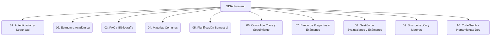

<<<<<<< HEAD
# SISA - Sistema Integrado de Seguimiento Academico
### Portal de Documentacion del Frontend (Quasar App)
=======
# 🚀 SISA - Sistema Integrado de Seguimiento Académico

### 💻 Portal de Documentación del Frontend (Quasar App)
>>>>>>> bb0efec01818361c4ce30bc06a0acd28515648ff

Bienvenido al repositorio oficial del **Frontend** de **SISA** (Sistema Integrado de Seguimiento Académico), una plataforma web de alto rendimiento y mobile-ready para la gestión, seguimiento y planificación académica a nivel universitario.

Este cliente web y móvil está desarrollado utilizando **Quasar Framework v2** (basado en **Vue 3 con Composition API**), impulsado por **Vite** y con soporte nativo de sincronización **Offline-First**.

---

## Indice de Documentacion Tecnica

Para facilitar la comprensión del sistema, la arquitectura y las reglas de negocio, se ha estructurado una suite de documentación técnica modular detallada en la carpeta `docs/`. Selecciona un módulo para explorar:



### Modulos Detallados:

1.  **[Autenticacion y Seguridad](docs/01_autenticacion_seguridad.md):** Inicio de sesion local offline, ciclo de vida del token con Pinia, interceptores Axios y guards del enrutador.
2.  **[Estructura Academica](docs/02_estructura_academica.md):** Gestion jerarquica de sedes, carreras, campus, bloques, aulas y mallas curriculares con selectores reactivos en cascada.
3.  **[PAC y Bibliografia](docs/03_pac_y_bibliografia.md):** Edicion jerarquica de temas, unidades, logros e importacion de planes desde documentos externos.
4.  **[Materias Comunes](docs/04_materias_comunes.md):** Logica de vinculacion inteligente de materias comunes y algoritmos de mezcla bidireccional de contenidos.
5.  **[Planificacion Semestral](docs/05_planificacion_semestral.md):** Cuadricula interactiva de 20 semanas para la programacion didactica del docente y su version offline.
6.  **[Control de Clase y Seguimiento](docs/06_control_clase_seguimiento.md):** **Flujo critico Offline-First** con marcas de asistencia, firmas digitales y carga de evidencias en disco local con Capacitor Filesystem.
7.  **[Banco de Preguntas y Evaluaciones](docs/07_banco_preguntas_evaluaciones.md):** Generacion aleatoria y balanceada de examenes basados en patrones de dificultad.
8.  **[Gestion de Evaluaciones y Rol de Examenes](docs/08_gestion_evaluaciones_y_examenes.md):** Directivas de examenes y calendario del Rol de Examenes con validaciones de colision en tiempo real.
9.  **[Sincronizacion y Motores de Comparacion](docs/09_sincronizacion_y_patrones.md):** Sincronizacion centralizada, comparadores analiticos pre/post sync, verificador lexical PDF y restaurador granular de backups.
10. **[CodeGraph - Herramientas de Desarrollo](docs/10_codegraph_dev_tools.md):** Grafo de conocimiento AST con tree-sitter para navegacion inteligente del codigo, busqueda estructural, trazado de flujos y analisis de impacto.

---

## Guia de Desarrollo Rapido

### Requisitos Previos

- **Node.js** >= 18.x
- **Yarn** o **NPM**
- **Quasar CLI** instalado globalmente (`npm i -g @quasar/cli`)

### 1. Instalación de Dependencias

```bash
npm install
# o con yarn:
yarn install
```

### 2. Ejecución en Modo de Desarrollo

Arranca el servidor local con recarga rápida (HMR):

```bash
npm run dev
# o con quasar cli:
quasar dev
```

### 3. Formateo y Calidad de Código

```bash
# Ejecutar Linter
npm run lint

# Formatear archivos con Prettier
npm run format
```

### 4. Construcción para Producción

Compila y optimiza la aplicación para el despliegue final:

```bash
npm run build
# o con quasar cli:
quasar build
```

---

## Tecnologias Utilizadas

- **Core:** Vue 3 (`<script setup>` con Composition API)
- **Framework UI:** Quasar Framework v2
- **Gestión de Estado:** Pinia con almacenamiento persistente local
- **Empaquetador:** Vite (ultra-rápido)
- **Cliente HTTP:** Axios (con interceptores automatizados de reintento y cola offline)
- **Móvil / Híbrido:** Capacitor JS (Network, Filesystem)

---
<<<<<<< HEAD
Desarrollado para el control y excelencia academica universitaria.
=======

Desarrollado con ❤️ para el control y excelencia académica universitaria.
>>>>>>> bb0efec01818361c4ce30bc06a0acd28515648ff
