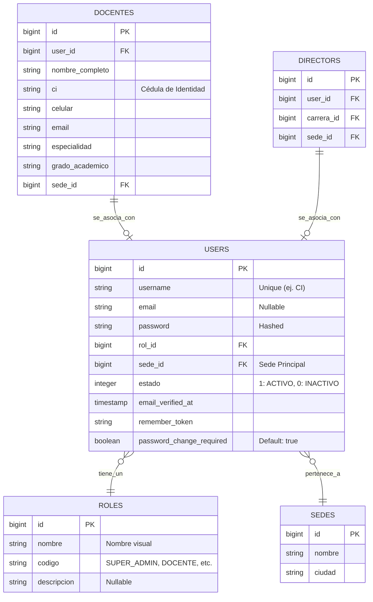
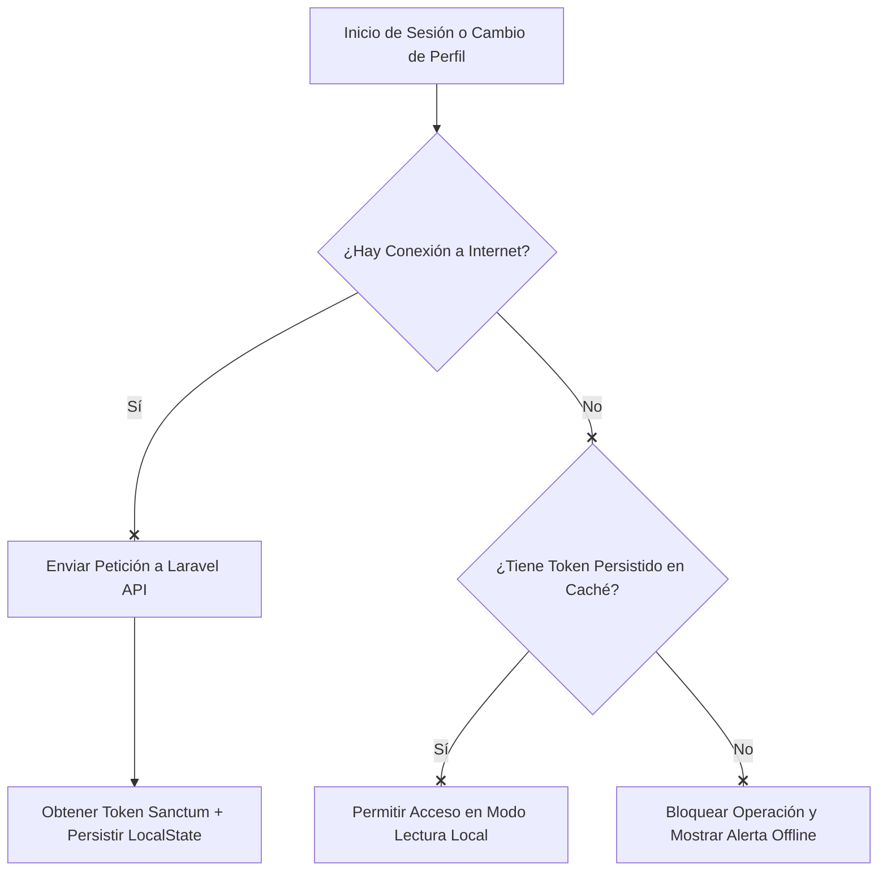

# Módulo 1: Autenticación, Seguridad y Perfiles (SISA 2.0)

Este módulo gestiona el ciclo de vida de la autenticación de usuarios, la asignación jerárquica de roles, permisos, control de accesos en el frontend y backend, y la actualización del perfil docente/administrativo.

---

## 1. Ficha Técnica

- **Backend:** Laravel v12.x (API REST) + PHP v8.2+ + Laravel Sanctum.
- **Frontend:** Quasar Framework v2.16.x + Vue 3.5.20 (Composition API con `<script setup>`).
- **Persistencia Local:** Pinia Store persistido con `pinia-plugin-persistedstate`.
- **Control de Accesos:** Middleware de Laravel y Guards en Vue Router.

---

## 2. Arquitectura de Datos (ER)

El siguiente diagrama detalla las tablas de la base de datos involucradas en la autenticación, roles, permisos y dependencias organizacionales del usuario.



---

## 3. Especificación de la API (Endpoints)

### 3.1 Inicio de Sesión (Login)

- **Método:** `POST`
- **Ruta:** `/api/login`
- **Throttle Limit:** 6 peticiones por minuto.
- **Request (JSON):**
  ```json
  {
    "username": "7654321",
    "password": "mi_password_segura"
  }
  ```
- **Response de Éxito (`200 OK`):**
  ```json
  {
    "success": true,
    "token": "3|sanctum_token_string_here...",
    "password_change_required": false,
    "user": {
      "id": 15,
      "username": "7654321",
      "nombre": "Juan",
      "apellido": "Perez",
      "email": "juan.perez@unitepc.edu.bo",
      "ci": "7654321",
      "estado": 1,
      "rol": {
        "id": 6,
        "codigo": "DOCENTE",
        "nombre": "Docente"
      },
      "docente": {
        "id": 8,
        "nombre_completo": "Juan Perez",
        "celular": "78945612",
        "sede_id": 1,
        "sede": {
          "id": 1,
          "nombre": "Cochabamba - Central"
        },
        "grupos": []
      }
    }
  }
  ```
- **Response de Error (`422 Unprocessable Entity` o `401 Unauthorized`):**
  ```json
  {
    "message": "Las credenciales proporcionadas son incorrectas.",
    "errors": {
      "username": ["Estas credenciales no coinciden con nuestros registros."]
    }
  }
  ```

### 3.2 Obtener Usuario Autenticado (Me)

- **Método:** `GET`
- **Ruta:** `/api/me`
- **Headers:** `Authorization: Bearer <token>`
- **Response de Éxito (`200 OK`):** Retorna la estructura detallada del objeto `user` con relaciones normalizadas (Roles, Docente, Grupos, Director, etc.).

### 3.3 Cambio de Contraseña Obligatorio / Voluntario

- **Método:** `POST`
- **Ruta:** `/api/change-password`
- **Request (JSON):**
  ```json
  {
    "new_password": "nueva_password_segura_123",
    "new_password_confirmation": "nueva_password_segura_123"
  }
  ```
- **Response de Éxito (`200 OK`):**
  ```json
  {
    "success": true,
    "message": "Contraseña actualizada exitosamente."
  }
  ```

### 3.4 Actualizar Perfil de Usuario

- **Método:** `POST`
- **Ruta:** `/api/update-profile`
- **Request (JSON):**
  ```json
  {
    "email": "nuevo.correo@unitepc.edu.bo",
    "telefono": "70712345",
    "formacion": "Magíster en Educación Superior"
  }
  ```
- **Response de Éxito (`200 OK`):**
  ```json
  {
    "success": true,
    "message": "Perfil actualizado correctamente.",
    "user": { ... }
  }
  ```

---

## 4. Componentes y Capa de Frontend (Quasar)

### 4.1 Almacenamiento Global (Pinia Store)

- **Ubicación:** `src/stores/auth.js`
- **Persistencia:** Configurado con `persist: true` para retener la sesión local (`auth_token` y `auth_user` en el LocalStorage).
- **Roles Jerárquicos Normalizados:** El store define niveles y alcances de permisos para controlar la UI de forma dinámica:
  - `SUPER_ADMIN` (Nivel 100): Control global del sistema.
  - `ADMIN` (Nivel 90): Visualización total + analíticas.
  - `VICERRECTOR_NACIONAL` (Nivel 80): Edición total a nivel nacional.
  - `VICERRECTOR_SEDE` (Nivel 70): Supervisión regional.
  - `DIRECCION_ACADEMICA` (Nivel 60): Control académico de sede.
  - `DIRECTOR_CARRERA` (Nivel 50): Gestión de planes de sus carreras.
  - `DOCENTE` (Nivel 30): Registro de clases de sus materias.

### 4.2 Axios Boot & Interceptores

- **Ubicación:** `src/boot/axios.js`
- **Comportamiento:** Inyecta automáticamente el token de Sanctum en los headers:
  ```javascript
  const token = localStorage.getItem('auth_token')
  if (token) {
    api.defaults.headers.common['Authorization'] = `Bearer ${token}`
  }
  ```
  Si la API devuelve un código `401 Unauthorized` (Token vencido o revocado), el interceptor borra el store local y redirige al `/login`.

### 4.3 Vistas Involucradas

- `src/pages/dashboards/`: Contiene los 6 Dashboards específicos mapeados dinámicamente según el rol.
- `src/pages/perfil/PerfilPage.vue`: Interfaz para que el docente actualice su especialidad, grado de formación, email y celular, interactuando con `/api/update-profile`.
- `src/components/RolSwitcher.vue`: Dropdown interactivo en la barra superior para cambiar entre roles activos en tiempo real si el usuario tiene múltiples roles asignados.

---

## 5. Arquitectura de Sincronización y Offline-First

Debido a que la seguridad del sistema requiere de validaciones y firmas criptográficas en el servidor, el flujo de autenticación aplica reglas específicas cuando no hay cobertura de red:



### Comportamiento del Módulo sin Conexión:

1.  **Validación de Sesión Existente:** Si el usuario ya había iniciado sesión con anterioridad, Pinia recupera el token y los datos del perfil desde el almacenamiento local persistente (`localStorage`). Se permite el ingreso completo al sistema móvil en modo **Solo Lectura (Offline cached)**.
2.  **Caché de Materias Asignadas:** Las materias y grupos cargados en la sesión del docente (`usuarioActual.materias_asignadas`) quedan cacheados, lo cual permite registrar avances locales y seguimientos de clase sin cobertura celular.
3.  **Bloqueo de Cambio de Credenciales:** Las operaciones de cambio de contraseña o cambio de perfil están bloqueadas en la UI si el flag del Capacitor Network reporta `connected === false`, previniendo inconsistencias de hashes de credenciales locales.
