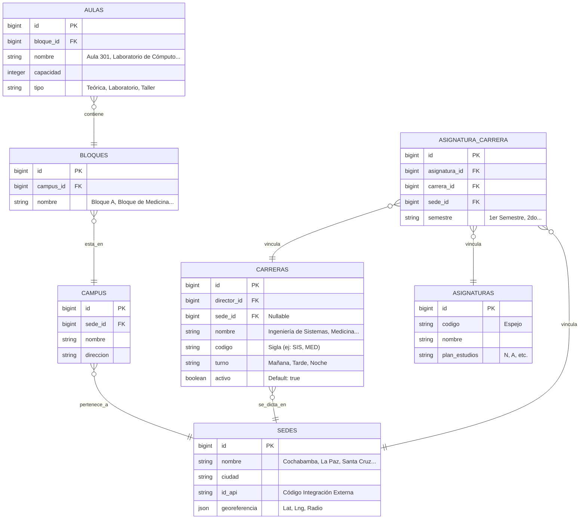

# Módulo 2: Estructura Académica (SISA 2.0)

Este módulo gestiona la infraestructura académica física (Sedes, Campus, Bloques, Aulas) y la estructura curricular (Carreras, Semestres y Mallas Curriculares). Soporta filtros en cascada rápidos y consistentes para docentes y administradores.

---

## 1. Ficha Técnica

*   **Backend:** Laravel v12.x (API REST) + PHP v8.2+.
*   **Frontend:** Quasar Framework v2.16.x + Vue 3.5.20 (Composition API con `<script setup>`).
*   **Caché:** Pinia Stores (`carreras.js`, `sedes.js`, `aulas.js`, `bloques.js`) persistidos localmente.
*   **Mecanismo de Filtros:** Filtros reactivos en cascada: `Sede` -> `Carrera` -> `Plan de Malla`.

---

## 2. Arquitectura de Datos (ER)

El módulo utiliza un conjunto de tablas que reflejan la estructura corporativa de **UNITEPC** a nivel nacional y de sedes regionales.



---

## 3. Especificación de la API (Endpoints)

### 3.1 Listar Sedes
*   **Método:** `GET`
*   **Ruta:** `/api/sedes`
*   **Response de Éxito (`200 OK`):**
    ```json
    [
      {
        "id": 1,
        "nombre": "Cochabamba - Central",
        "ciudad": "Cochabamba",
        "id_api": "CBA",
        "georeferencia": { "lat": -17.3912, "lng": -66.1523, "radio_metros": 150 }
      }
    ]
    ```

### 3.2 Listar Carreras por Sede (Filtro en Cascada)
*   **Método:** `GET`
*   **Ruta:** `/api/carreras`
*   **Query Parameters:** `?sede_id=1`
*   **Response de Éxito (`200 OK`):**
    ```json
    [
      {
        "id": 5,
        "nombre": "Ingeniería de Sistemas",
        "codigo": "SIS",
        "sede_id": 1,
        "activo": true,
        "asignaturas_count": 45,
        "docentes_count": 12
      }
    ]
    ```

### 3.3 Listar Asignaturas por Carrera y Semestre
*   **Método:** `GET`
*   **Ruta:** `/api/carreras/{carrera_id}/asignaturas`
*   **Query Parameters:** `?sede_id=1&semestre=1er%20Semestre`
*   **Response de Éxito (`200 OK`):**
    ```json
    [
      {
        "id": 12,
        "codigo": "SIS-111",
        "nombre": "Cálculo I",
        "semestre": "1er Semestre",
        "plan_estudios": "N",
        "creditos": 5
      }
    ]
    ```

### 3.4 CRUD Aulas (Gestión de Infraestructura)
*   **Método:** `GET` / `POST` / `PUT` / `DELETE`
*   **Ruta:** `/api/aulas` y `/api/aulas/{id}`
*   **Request Crear Aula (JSON):**
    ```json
    {
      "bloque_id": 3,
      "nombre": "Aula 402 - Virtual",
      "capacidad": 45,
      "tipo": "Teorica"
    }
    ```
*   **Response de Éxito (`201 Created`):** Retorna el objeto `Aula` con el bloque asociado.

---

## 4. Componentes y Capa de Frontend (Quasar)

### 4.1 Stores de Pinia para Infraestructura
*   `src/stores/sedes.js`: Cachea las sedes autorizadas para el usuario y maneja la sede activa seleccionada en los paneles.
*   `src/stores/carreras.js`: Almacena la lista de carreras a nivel nacional/regional, permitiendo el filtrado rápido mediante `getCarrerasBySede(sedeId)`.
*   `src/stores/aulas.js` y `src/stores/bloques.js`: Dan soporte al CRUD reactivo para la administración física del sistema.

### 4.2 Selectores y Filtros Reactivos en Cascada
En las vistas administrativas y de directores (como `GestionAcademicaPage.vue` o `SincronizacionPage.vue`), se utiliza una reactividad encadenada en Vue 3 para filtrar asignaturas y grupos:

```javascript
// Reactividad en Cascada
const selSede = ref(null)
const selCarrera = ref(null)
const selAsignatura = ref(null)

// Watchers que limpian selecciones inferiores al cambiar el nivel superior
watch(selSede, () => {
  selCarrera.value = null
  selAsignatura.value = null
  carrerasFiltradas.value = carrerasStore.getCarrerasBySede(selSede.value)
})

watch(selCarrera, async () => {
  selAsignatura.value = null
  if (selCarrera.value) {
    await cargarAsignaturas(selCarrera.value, selSede.value)
  }
})
```

### 4.3 Vistas Involucradas
*   `src/pages/admin/SedesPage.vue`: Interfaz de administración para configurar coordenadas de geocercas por sede (para el control de asistencia).
*   `src/pages/admin/GestionAcademicaPage.vue`: Panel unificado de control de carreras, bloques, aulas y asignaturas asociadas.

---

## 5. Arquitectura de Sincronización y Offline-First

Las tablas de infraestructura y currículas son típicamente estáticas o de baja variación temporal. Esto permite un flujo óptimo sin cobertura de internet:

1.  **Carga Inicial y Seed en LocalStorage:** Al iniciar sesión por primera vez con red, el frontend precarga el listado completo de sedes, campus, aulas, carreras y materias en Pinia.
2.  **Modo Offline Permanente:** Toda la navegación curricular de SISA 2.0 (consultar materias, horarios asignados, aulas de clases, semestres, docentes) funciona **100% offline** consumiendo la memoria local del Store.
3.  **Inhibición de Operaciones CRUD en Offline:** Si el estado del Capacitor Network reporta desconexión, la UI bloquea automáticamente los botones de creación/edición de aulas, bloques y sedes, mostrando un indicador visual de "Sin conexión: Operación no disponible".
