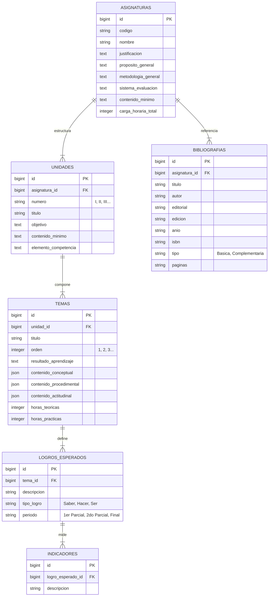

# Módulo 3: Programa Analítico Curricular (PAC) y Bibliografía (SISA 2.0)

Este módulo es el núcleo documental de **SISA 2.0**. Permite estructurar de forma jerárquica el Programa Analítico Curricular (PAC) de cada asignatura (Unidades -> Temas -> Logros Esperados -> Indicadores) y sus bibliografías de referencia, incluyendo un motor dinámico para calcular el progreso de documentación por docente.

---

## 1. Ficha Técnica

- **Backend:** Laravel v12.x + PHP v8.2+ + PHPSpreadsheet (para parsing masivo).
- **Frontend:** Quasar Framework v2.16.x + Vue 3.5.20 (Composition API).
- **Motor de Progreso:** Algoritmo ponderado en 5 ejes reactivos en el frontend.
- **Importadores masivos:** Controladores preparados para parsear documentos `.docx` y `.xlsx`.

---

## 2. Arquitectura de Datos (ER)

El PAC se representa en la base de datos mediante una jerarquía estricta de uno a muchos:



---

## 3. Especificación de la API (Endpoints)

### 3.1 Actualizar Generalidades del PAC (Asignatura)

- **Método:** `PUT`
- **Ruta:** `/api/asignaturas/{id}`
- **Request (JSON):**
  ```json
  {
    "justificacion": "La física es clave...",
    "proposito_general": "Introducir conceptos...",
    "metodologia_general": "Aprendizaje basado en problemas...",
    "sistema_evaluacion": "Parciales 60%, Práctico 40%"
  }
  ```
- **Response de Éxito (`200 OK`):** Retorna el objeto `Asignatura` actualizado.

### 3.2 CRUD Unidades y Temas

- **Crear Unidad:** `POST /api/planificacion/asignaturas/{id}/unidades`
- **Crear Tema:** `POST /api/planificacion/unidades/{id}/temas`
- **Reordenar Temas (Mover Arriba/Abajo):**
  - **Método:** `POST`
  - **Ruta:** `/api/planificacion/temas/{id}/move`
  - **Request (JSON):** `{ "direction": "up" }` (o `"down"`)

### 3.3 Editar Tema Completo (Unificado)

- **Método:** `PUT`
- **Ruta:** `/api/planificacion/temas/{id}/contenido`
- **Request (JSON):**
  ```json
  {
    "conceptual": ["Concepto A", "Concepto B"],
    "procedimental": ["Procedimiento A"],
    "actitudinal": ["Actitud Colaborativa"],
    "horas_teoricas": 4,
    "horas_practicas": 2
  }
  ```

### 3.4 CRUD Bibliografías

- **Método:** `GET` / `POST` / `PUT` / `DELETE`
- **Ruta:** `/api/bibliografias` y `/api/bibliografias/{id}`
- **Request Crear (JSON):**
  ```json
  {
    "asignatura_id": 12,
    "titulo": "Física Universitaria",
    "autor": "Sears & Zemansky",
    "editorial": "Pearson",
    "edicion": "13va Edición",
    "anio": "2013",
    "tipo": "Basica"
  }
  ```

---

## 4. Componentes y Capa de Frontend (Quasar)

### 4.1 Almacén Pinia (`src/stores/asignaturas.js`)

Centraliza todo el flujo curricular y provee los datos descriptivos del PAC al frontend.

### 4.2 Lógica del Motor de Progreso PAC

El progreso de documentación de cada tema se evalúa dinámicamente en el frontend mediante el método `calcularProgresoTema(tema)`, promediando **5 ejes fundamentales (20% cada uno)**:

1.  **Resultados de Aprendizaje (20%):** Verifica si el tema tiene cargado el `resultado_aprendizaje` y si tiene al menos un logro esperado con su correspondiente indicador de evaluación.
2.  **Contenidos Curriculares (20%):** Pondera la presencia de elementos cargados en los arrays de `contenido_conceptual`, `contenido_procedimental` y `contenido_actitudinal`.
3.  **Estrategias Didácticas (20%):** Evalúa si el docente completó las estrategias metodológicas, las estrategias de aprendizaje y los recursos didácticos a utilizar.
4.  **Sistema de Evaluación (20%):** Valida que se hayan declarado actividades, instrumentos y evidencias tanto para la evaluación **Formativa** como para la **Sumativa**.
5.  **Secuencia Didáctica (20%):** Mide la completitud del plan de sesión o momentos didácticos (Inicio, Desarrollo y Cierre) dentro del grid pedagógico.

> [!NOTE]
> Si el promedio total del tema es **100%**, el frontend renderiza un badge verde de "Completado". Si el promedio es menor, se muestra en color naranja/rojo incitando al docente a culminar la planificación.

### 4.3 Vistas Involucradas

- `src/pages/documentacion/AsignaturaEditPage.vue`: Interfaz para rellenar las justificaciones, objetivos generales e importar documentos masivos de mallas académicas.
- `src/pages/documentacion/PlanificacionPage.vue`: Árbol interactivo que organiza las Unidades y los Temas. Permite agregar, reordenar y eliminar elementos del árbol.
- `src/pages/documentacion/TemaEditPage.vue`: Formulario detallado de 5 pestañas que corresponde exactamente al motor de progreso de planificación.

---

## 5. Arquitectura de Sincronización y Offline-First

El PAC requiere estabilidad y persistencia durante la redacción, la cual suele ser extensa por parte de los docentes.

1.  **Redacción Segura sin Red:** El frontend de Quasar guarda en memoria temporal reactiva cada cambio del PAC. Si la conexión a internet cae, el docente puede continuar escribiendo objetivos, agregando logros o seleccionando bibliografías.
2.  **Persistencia Local Completa:** Al presionar "Guardar" sin red, el Pinia store guarda el payload completo del PAC bajo la clave persistente local. El flag `modificado_localmente` se activa a nivel de asignatura.
3.  **Importación Masiva de Archivos:** Las opciones de "Importar desde Word" o "Excel" validan la disponibilidad de red. Debido a que el procesamiento de archivos se ejecuta en el servidor de Laravel, estas herramientas quedan deshabilitadas si el dispositivo está en modo offline.
