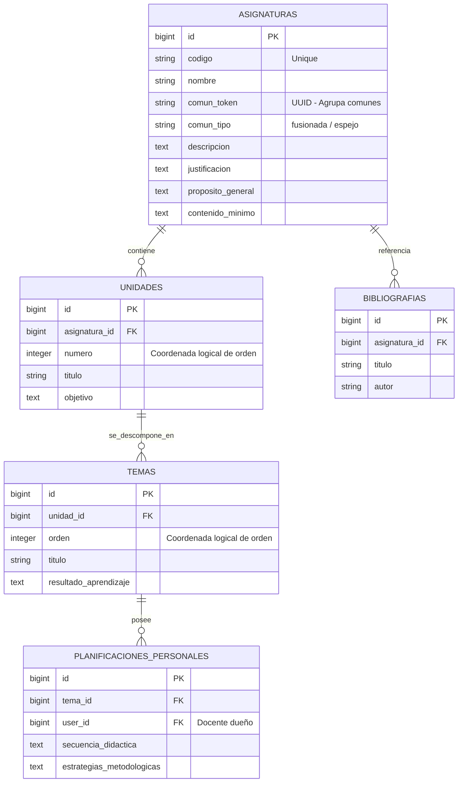
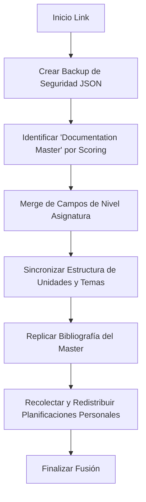

# Módulo 4: Materias Comunes, Merge Inteligente y Sincronización (SISA 2.0)

Este módulo gestiona la equivalencia y vinculación de asignaturas dictadas de manera simultánea o que comparten idéntico plan de estudios ("materias comunes") bajo un mismo docente o diferentes paralelos. Incorpora un motor avanzado de **Merge Inteligente** que consolida la documentación y las planificaciones personales de forma bidireccional, y previene bucles recursivos durante la replicación automática de datos.

---

## 1. Ficha Técnica

- **Backend:** Laravel v12.x (API REST) + PHP v8.2+ + Eloquent ORM.
- **Servicio Núcleo:** `App\Services\MateriasComunesSyncService` (encargado del merge y replicación).
- **Mapeo Estructural:** Unificación de estructuras por coordenadas lógicas (`unidad.numero` + `tema.orden`) en vez de IDs físicos incrementales.
- **Seguridad y Prevención:** Flag estático `$isSyncing` para evitar loops de sincronización y recursión infinita en disparadores de bases de datos o eventos Eloquent.
- **Integridad y Respaldos:** Integración con `App\Services\FusionBackupService` que genera volcados JSON pre-fusión recuperables ante inconsistencias.

---

## 2. Arquitectura de Datos (ER)

El modelo de base de datos utiliza la tabla `asignaturas` enriquecida con metadatos de vinculación común, relacionando múltiples registros al mismo grupo lógico.



### Reglas de Negocio del Esquema:

1.  **`comun_token` (UUID):** Llave lógica que agrupa dos o más registros de `asignaturas`. Todas las materias en el mismo grupo comparten idéntica documentación base del PAC y programa analítico.
2.  **`comun_tipo`:** Configurado principalmente como `fusionada`. Implica que comparten el cronograma maestro de sesiones semestrales y la planificación, reduciendo el trabajo administrativo del docente a un solo grid interactivo.

---

## 3. Especificación de la API (Endpoints)

### 3.1 Listado de Grupos Comunes (Index)

- **Método:** `GET`
- **Ruta:** `/api/materias-comunes`
- **Headers:** `Authorization: Bearer <token>` (Rol: `DIRECTOR_CARRERA` o superior)
- **Response de Éxito (`200 OK`):**
  ```json
  [
    {
      "id": 14,
      "comun_token": "439f0412-25de-4b5a-8b54-c1c8c48199ca",
      "comun_tipo": "fusionada",
      "base": {
        "id": 14,
        "codigo": "SIS-101",
        "nombre": "Introducción a la Programación",
        "carrera_nombre": "Ingeniería de Sistemas"
      },
      "vinculadas": [
        {
          "id": 25,
          "codigo": "TEL-101",
          "nombre": "Programación I",
          "carrera_nombre": "Ingeniería de Telecomunicaciones"
        }
      ],
      "total_materias": 2
    }
  ]
  ```

### 3.2 Buscar Materias Candidatas

Busca asignaturas del mismo campus/sede para asociar, excluyendo las carreras gestionadas directamente por el director logueado y la materia base del stepper.

- **Método:** `GET`
- **Ruta:** `/api/materias-comunes/candidates`
- **Parámetros:** `asignatura_id` (Base ID), `search` (Query de texto)
- **Response de Éxito (`200 OK`):**
  ```json
  [
    {
      "id": 88,
      "codigo": "IND-101",
      "nombre": "Computación Básica",
      "carrera_nombre": "Ingeniería Industrial"
    }
  ]
  ```

### 3.3 Vincular Dos Asignaturas (Fusión & Merge)

Ejecuta la vinculación creando o uniendo grupos a través del UUID, respaldando la información e iniciando el algoritmo de Merge Inteligente.

- **Método:** `POST`
- **Ruta:** `/api/materias-comunes/link`
- **Request (JSON):**
  ```json
  {
    "asignatura_id": 14,
    "target_asignatura_id": 88,
    "tipo": "fusionada"
  }
  ```
- **Response de Éxito (`200 OK`):**
  ```json
  {
    "message": "Vinculación exitosa"
  }
  ```
- **Response con Advertencias:**
  ```json
  {
    "message": "Vinculación exitosa",
    "warnings": [
      "No se pudo crear backup de seguridad, pero la vinculación continuó.",
      "No se pudo sincronizar el cronograma entre materias vinculadas."
    ]
  }
  ```

### 3.4 Desvincular Asignatura (Unlink)

- **Método:** `POST`
- **Ruta:** `/api/materias-comunes/unlink/{id}`
- **Reglas del Ciclo de Desvinculación:**
  - Si el grupo consta de **solo 2 materias**, ambas pierden el `comun_token` (el grupo se disuelve).
  - Si consta de **3 o más**, solo la materia especificada pierde el token. Si al finalizar la operación queda una única materia remanente con el token, este se remueve automáticamente para evitar la existencia de grupos de un solo elemento.

---

## 4. El Motor de Merge Inteligente (Backend Deep-Dive)

A diferencia de las fusiones tradicionales donde una entidad sobrescribe por completo a la otra ("el ganador se lleva todo"), SISA 2.0 implementa una consolidación no destructiva campo a campo en `MateriasComunesSyncService::mergeAndSyncOnLink()` bajo el siguiente flujo:

### 4.1 Algoritmo de Consolidación



### 4.2 Métricas de Scoring (`scoreDocumentation`)

Para determinar cuál es la asignatura dominante de la que se copiará el esqueleto base (Unidades, Temas, Logros e Indicadores), el sistema puntúa cada asignatura en base al llenado de campos PAC:

- **Campos PAC Críticos (Justificación, Propósito):** +90 puntos cada uno.
- **Competencia Global / Específica:** +60 puntos.
- **Metodología, Evaluación, Contenido Mínimo:** +30 puntos cada uno.
- **Unidades Académicas Creadas:** +1 punto por unidad.
- **Temas de la Unidad Documentados (Resultado, Conceptual):** +2 puntos por tema.
- **Logros Esperados:** +1 punto por cada logro.
- **Bibliografía:** +2 puntos por entrada de libro.

La asignatura con mayor puntaje es declarada **"Documentation Master"**.

### 4.3 Merge de Atributos del Plan de Asignatura (`buildMergedAsignaturaFields`)

El sistema crea una estructura de datos limpia mezclando lo mejor de ambos mundos:

```php
// Si el master tiene el campo vacío, busca secuencialmente en el resto del grupo
$best = $docMaster->$field;
if ($this->isFieldEmpty($best)) {
    foreach ($asignaturas as $asig) {
        if ($asig->id !== $docMaster->id && !$this->isFieldEmpty($asig->$field)) {
            $best = $asig->$field;
            break;
        }
    }
}
```

### 4.4 Redistribución de Planificaciones Personales (`collectAllPlanificaciones`)

Debido a que el docente pudo haber llenado el PAC en una carpeta del sistema y sus metodologías de clase en otra (porque solo una tenía grupos/horarios válidos asignados), el motor:

1.  **Recolecta de forma bidireccional:** Indexa todas las entradas de `planificaciones_personales` mapeándolas por `[user_id][unidad_numero][tema_orden]`.
2.  **Combina Contenido:** Si el mismo docente tiene datos en ambas asignaturas para la misma sesión, mezcla los campos (`estrategias_metodologicas`, `secuencia_didactica`, etc.) prefiriendo los valores no vacíos.
3.  **Redistribuye:** Guarda y replica estas planificaciones a todas las materias unificadas vinculándolas con sus nuevos IDs de temas correspondientes.

### 4.5 Evitación de Recursión Cíclica

Para prevenir que un disparador de actualización (como un Observer Eloquent de `Tema` o `Unidad`) desencadene un loop infinito al actualizar las materias hermanas, el servicio encapsula las transacciones bajo un interruptor de exclusión mutua:

```php
private static bool $isSyncing = false;

public function syncTema(Tema $tema): int
{
    if (self::$isSyncing) return 0; // Rompe el bucle de eventos repetidos

    self::$isSyncing = true;
    try {
        // Transacción de replicación a asignaturas vinculadas...
    } finally {
        self::$isSyncing = false; // Restablece el flujo
    }
}
```

---

## 5. Componentes y Capa de Frontend (Quasar)

La gestión de materias comunes se concentra en `src/pages/director/MateriasComunesPage.vue` con las siguientes características dinámicas de experiencia de usuario:

1.  **Stepper y Selectores Reactivos:** Guía al usuario a través del flujo seleccionando primero la asignatura gestionada propia y abriendo un buscador asíncrono para elegir las asignaturas vinculadas del campus.
2.  **Dropdown Asíncrono con Filtro de Búsqueda:** Utiliza `<q-select>` con el evento `@filter` para buscar en la base de datos de materias locales a medida que el director escribe, mejorando el rendimiento ante listas extensas de asignaturas.
3.  **Procesamiento y Notificación de Advertencias:** Evalúa la respuesta de la API. Si la fusión arrojó warnings (ej. fallos menores al recrear la bibliografía o los backups), los presenta ordenadamente en un banner flotante de color naranja sin interrumpir la experiencia de vinculación exitosa básica.

---

## 6. Sincronización en Escenarios Offline

La vinculación de materias comunes es una **operación puramente online**. Debido al riesgo de colisión de datos, a la complejidad del algoritmo de scoring, y a la necesidad de crear backups de base de datos antes de proceder, el sistema aplica las siguientes políticas de red:

> [!IMPORTANT]
> El botón "Vincular Materias" y la acción de desvinculación se inhabilitan visualmente en la interfaz si el sensor del dispositivo reporta pérdida de conectividad (`Capacitor Network.getStatus().connected === false`).

- **Lectura Caché:** El listado de grupos de materias comunes se almacena localmente en la caché de Pinia del director. Esto permite al director de carrera visualizar las materias equivalentes y revisar su composición incluso en áreas de nula señal.
- **Edición de Documentos Comunes Offline:** Si el docente edita la planificación de una materia que está marcada con un `comun_token` en estado offline, el frontend procesa la edición localmente. Al restablecerse la conexión, la cola de sincronización envía la edición de la materia modificada, y el backend se encarga de esparcir automáticamente los cambios a todas las asignaturas comunes asociadas mediante el servicio `MateriasComunesSyncService`.
