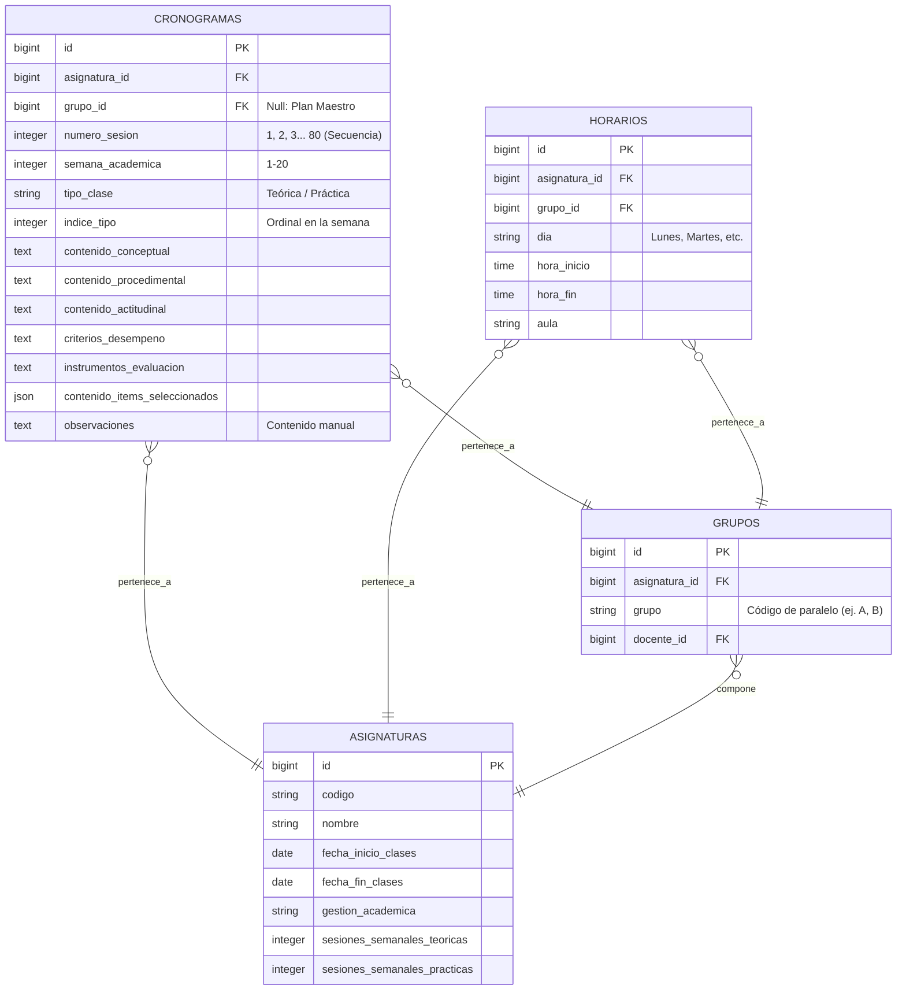

# Módulo 5: Planificación Semestral y Cronogramas (SISA 2.0)

Este módulo gestiona la dosificación temporal de los contenidos del programa analítico de las asignaturas a lo largo de un semestre estándar de **20 semanas**, traduciendo la estructura académica en una grilla cronológica de sesiones individuales. Cuenta con generación automática, detección inteligente de hitos de evaluación y un motor de copia e importación de plantillas docentes.

---

## 1. Ficha Técnica

*   **Backend:** Laravel v12.x (API REST) + PHP v8.2+ + Eloquent ORM.
*   **Servicio de Excel:** `App\Services\CronogramaParserService` (análisis y lectura del archivo de planificación PAC).
*   **Cómputo Temporal:** Dosificación paramétrica a través de sesiones semanales configurables (Teóricas y Prácticas).
*   **Hitos de Examen (Semanas Académicas):**
    *   **Semanas 7 - 8:** Primer Parcial.
    *   **Semanas 14 - 15:** Segundo Parcial.
    *   **Semanas 18 - 19:** Examen Final.
    *   **Semana 20:** Segunda Instancia.

---

## 2. Arquitectura de Datos (ER)

El siguiente diagrama Mermaid representa las tablas del sistema asociadas a los cronogramas maestros, horarios y las planificaciones por semestre.



### Reglas de Negocio Estructurales:
1.  **Plan Maestro (`grupo_id = NULL`):** Los registros del cronograma que no tienen un `grupo_id` asignado componen el **Cronograma Maestro** de la materia. Este sirve como plantilla compartida y obligatoria para todos los docentes y paralelos de la misma sede.
2.  **`numero_sesion`:** Número correlativo global secuencial calculado según la carga de clases semanales (ej. si la materia tiene 4 clases por semana, la semana 1 abarcará las sesiones 1, 2, 3 y 4; la semana 2 abarcará de la 5 a la 8, hasta totalizar aproximadamente 80 sesiones en el semestre).
3.  **`indice_tipo`:** Especifica el orden de la sesión dentro de su tipo en la semana (ej. "Teórica 1", "Teórica 2"), crucial para la sincronización cruzada e independiente del paralelo o los días de la semana específicos del docente.

---

## 3. Especificación de la API (Endpoints)

### 3.1 Obtener la Planificación Semestral (Index)
*   **Método:** `GET`
*   **Ruta:** `/api/planificacion-semestral/{asignatura_id}`
*   **Parámetros query (opcionales):** `grupo_id` (ID de paralelo), `docente_id` (ID de docente)
*   **Response de Éxito (`200 OK`):**
    ```json
    {
      "config": {
        "fecha_inicio_clases": "2026-02-09",
        "fecha_fin_clases": "2026-06-27",
        "gestion_academica": "2026-I"
      },
      "horarios": [
        {
          "id": 45,
          "dia": "Lunes",
          "hora_inicio": "08:00:00",
          "hora_fin": "09:30:00",
          "aula": "Laboratorio 3",
          "grupo_id": 8
        }
      ],
      "planificacion": [
        {
          "cronograma_id": 156,
          "numero_sesion": 1,
          "semana_academica": 1,
          "tipo_clase": "Teórica",
          "indice_tipo": 1,
          "contenido_conceptual": "Fundamentos de bases de datos relacionales",
          "contenido_procedimental": "Diferenciación de modelos relacionales y no relacionales",
          "contenido_actitudinal": "Puntualidad e interés científico",
          "criterios_desempeno": "Identifica estructuras de datos correctamente",
          "instrumentos_evaluacion": "Prueba conceptual objetiva",
          "contenido_items_seleccionados": [12, 13],
          "observaciones": null,
          "cumplido": false
        }
      ]
    }
    ```

### 3.2 Guardar Configuración (Horarios y Fechas)
*   **Método:** `POST`
*   **Ruta:** `/api/planificacion-semestral/{asignatura_id}/config`
*   **Request (JSON):**
    ```json
    {
      "fecha_inicio_clases": "2026-02-09",
      "fecha_fin_clases": "2026-06-27",
      "gestion_academica": "2026-I",
      "grupo_id": 8,
      "horarios": [
        {
          "dia": "Lunes",
          "hora_inicio": "08:00",
          "hora_fin": "09:30",
          "aula": "Aula 204"
        }
      ]
    }
    ```

### 3.3 Generación Automática del Cronograma Maestro
Crea la secuencia limpia de sesiones semestrales vaciando la planificación previa.
*   **Método:** `POST`
*   **Ruta:** `/api/planificacion-semestral/{asignatura_id}/generar`
*   **Response de Éxito (`200 OK`):**
    ```json
    {
      "message": "Planificación Maestra generada exitosamente"
    }
    ```

### 3.4 Copiar / Importar Contenidos de Otra Asignatura
*   **Método:** `POST`
*   **Ruta:** `/api/planificacion-semestral/{asignatura_id}/copiar`
*   **Request (JSON):**
    ```json
    {
      "source_asignatura_id": 12
    }
    ```

---

## 4. Flujo de Trabajo y Reglas de la Grilla (Semana 1 a 20)

La grilla de planificación semestral se compone estrictamente de 20 semanas en correspondencia con el calendario académico de la UNITEPC.

```mermaid
gantt
    title Cronograma Semestral Estándar (20 Semanas)
    dateFormat  X
    axisFormat %d
    
    section Clases Regulares
    Unidad I a III : active, 0, 6
    Unidad IV a V : active, 8, 13
    Unidad VI (Cierre) : active, 15, 17
    
    section Evaluaciones
    1er Parcial (Sem 7-8) : crit, 6, 8
    2do Parcial (Sem 14-15) : crit, 13, 15
    Final (Sem 18-19) : crit, 17, 19
    2da Instancia (Sem 20) : crit, 19, 20
```



### 4.1 Generación Inteligente de Semanas de Examen
El backend genera automáticamente la secuencia completa de sesiones según las horas teóricas y prácticas asignadas. No obstante, al realizar el análisis del documento Excel (`CronogramaParserService`) o en la visualización frontend de la grilla de planificación, se aplican reglas especiales para los periodos de examen:
*   **Detección de Filas de Evaluación:** Durante la importación del Excel, si el parser detecta en las columnas de contenido o temas las palabras clave `EXAMEN`, `PARCIAL`, `FINAL` o `INSTANCIA`, **limpia automáticamente** las celdas asociadas a aprendizajes conceptuales, procedimentales y actitudinales y a criterios de desempeño, dejando únicamente el indicador del examen y el tipo de instrumento evaluativo.
*   **Resaltado en la UI (Frontend):** Las sesiones que caen dentro de las semanas de exámenes oficiales (cargados dinámicamente desde el almacén de roles de exámenes de la sede) se pintan de manera especial (`bg-orange-1` con bordes anaranjados y un badge identificatorio del parcial correspondiente), permitiendo una rápida auditoría visual del cumplimiento del calendario nacional.

### 4.2 Lógica de Mapeo y Normalización Cruzada
Debido a que el docente del grupo A puede dar clases Lunes/Miércoles y el del grupo B Martes/Viernes, los números globales de sesión física difieren en fechas calendario reales. Para mapear la grilla común de forma consistente en el frontend, el sistema normaliza la comparación:
1.  **Conversión:** Cada clase se transforma en un tipo normalizado (`teorica` o `practica`).
2.  **Ordinalidad:** Se calcula el índice ordinal dentro de la semana académica (`indice_tipo`).
3.  **Matching:** El frontend aparea los datos de la base de datos con la fila correspondiente comparando `semana` + `tipo` + `indice_tipo`. De este modo, la planificación se consolida globalmente en el maestro sin importar el horario específico asignado a cada paralelo.

---

## 5. Componentes y Capa de Frontend (Quasar)

El grid completo de planificación académica interactiva se ejecuta en `src/pages/documentacion/PlanificacionPage.vue`, estructurado con una arquitectura premium:

1.  **Formulario Estructurado en Pestañas (Tabs):** Organiza el flujo de trabajo en:
    *   *Horario y Calendario:* Configuración del semestre, gestión académica y carga física de aulas.
    *   *Planificación Semestral:* La grilla editable interactiva de dosificación por unidad/sesión.
    *   *Vista de Impresión (Preview):* Formato estandarizado institucional para la exportación y firma en PDF.
2.  **Selector de Temas Cruzado Dinámico:** Cada sesión cuenta con un dropdown interactivo multiselect que extrae los temas estructurados en el PAC (módulo 3), vinculándolos por IDs y poblando de manera predictiva las columnas de aprendizaje conceptual, procedimental y actitudinal a partir de la planificación personal de cada docente.
3.  **Sistema de Guardado Silencioso (Auto-Save):** Incorpora un observador reactivo con temporizador de retraso (`watchDebounced` de `@vueuse/core` con 1500ms de calma). Compara constantemente la grilla actual contra un snapshot serializado de la última versión salvada. Al detectar inactividad en la escritura del docente, envía de forma asíncrona la información a la API, actualizando la etiqueta de estado a "Guardado correctamente" sin interrumpir la edición ni requerir confirmación manual.
4.  **Buscador y Drag and Drop de Excel:** El diálogo de importación permite arrastrar directamente el libro de Excel del plan de clase. Informa en tiempo real el tamaño del documento, analiza la estructura por columnas y ofrece la opción "Importar solo en sesiones teóricas" si las horas prácticas corresponden a actividades hospitalarias o clínicas libres no parametrizadas en el PAC.
