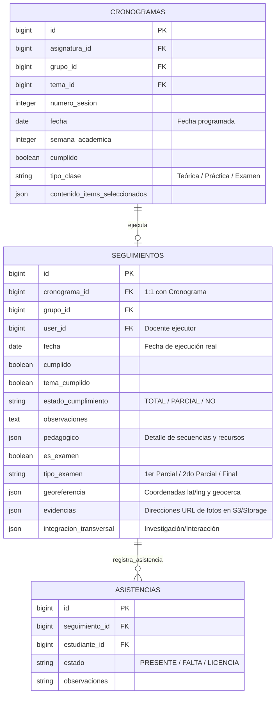

# Módulo 6: Control de Clase y Seguimiento Offline-First (SISA 2.0)

Este módulo gestiona el registro y la verificación en tiempo real del cumplimiento académico por sesión de clase. Para lidiar con zonas de baja cobertura celular o aulas subterráneas, incorpora un motor de sincronización híbrido **Offline-First** que permite a los docentes registrar firmas, avances de temas, asistencia, georreferenciación y capturar evidencias fotográficas sin internet, persistiendo los datos localmente y subiéndolos automáticamente una vez restablecida la red.

---

## 1. Ficha Técnica

*   **Backend:** Laravel v12.x + PHP v8.2+ + Eloquent ORM + Carbon (Manejo de Tiempos).
*   **Frontend UI:** Quasar Framework v2.x + Vue 3 (Composition API con `<script setup>`).
*   **Gestión de Estado y Cola Local:** Pinia Stores (`sync.js` y `syncQueue.js`) con persistencia local habilitada por `pinia-plugin-persistedstate`.
*   **Capacidades Nativas Mobile:** `@capacitor/network` (sensado de red), `@capacitor/filesystem` (almacenamiento binario local) y `@capacitor/camera` (evidencias fotográficas directas).
*   **Controladores Backend:** `App\Http\Controllers\PlanificacionSemestralController`, `App\Http\Controllers\SeguimientoSemanalController`.
*   **Propagación en Comunes:** `PlanificacionSemestralController::propagarSeguimientoAComunes()` con resolución basada en antigüedad de marcas de tiempo.

---

## 2. Arquitectura de Datos (ER)

El registro de seguimiento enlaza directamente a cada sesión del cronograma individual de grupo y guarda el detalle de auditoría pedagógica, evidencias multimedia y coordenadas físicas.



### Reglas de Negocio del Esquema:
1.  **Enlace 1:1 Semántico:** Un `Seguimiento` pertenece a una única sesión del `Cronograma`. Si se realiza el seguimiento, el campo `cronograma.cumplido` se sincroniza con el estado de cumplimiento (`cumplido`).
2.  **Estructura JSON Flexible:** 
    *   `georeferencia`: Guarda `{ "latitude": double, "longitude": double, "accuracy": double, "en_rango": boolean }` para control de geocercas en sedes.
    *   `pedagogico`: Estructura modular del avance de clase:
        ```json
        {
          "aprendizaje_activo": { "desarrollado": true, "comentario": "..." },
          "evaluacion_formativa": { "aplicado": true, "instrumento": "..." },
          "secuencia_didactica": { "inicio": true, "desarrollo": true, "cierre": true }
        }
        ```
    *   `evidencias`: Mapeo de almacenamiento en el storage de Laravel para imágenes asociadas a cada evidencia pedagógica o transversal.

---

## 3. Especificación de la API (Endpoints)

El backend de Laravel expone endpoints REST robustos para el registro de clases de seguimiento y generación de reportes administrativos.

### 3.1 Crear o Actualizar Seguimiento (Save)
Permite enviar tanto objetos JSON tradicionales como archivos en formato `multipart/form-data` para las evidencias físicas en el mismo request.
*   **Método:** `POST`
*   **Ruta:** `/api/planificacion-semestral/seguimiento`
*   **Headers:** `Content-Type: multipart/form-data`, `Authorization: Bearer <token>`
*   **Parámetros del FormData:**
    *   `cronograma_id`: (int) ID de la sesión planificada.
    *   `grupo_id`: (int) ID del grupo.
    *   `asignatura_id`: (int) ID de la asignatura base.
    *   `fecha`: (date) "2026-05-19"
    *   `estado_cumplimiento`: (string) `"TOTAL" | "PARCIAL" | "NO"`
    *   `tema_cumplido`: (string) `"true" | "false"`
    *   `observaciones`: (string) Comentarios adicionales de clase.
    *   `pedagogico`: (json string) Metadatos pedagógicos.
    *   `integracion_transversal`: (json string) Coordinaciones transversales.
    *   `georeferencia`: (json string) Ubicación actual.
    *   `evidencia_aprendizaje`: (file) Archivo binario de imagen (opcional).
    *   `evidencia_evaluacion`: (file) Archivo binario de imagen (opcional).
    *   `evidencia_secuencia`: (file) Archivo binario de imagen (opcional).
*   **Response de Éxito (`200 OK`):**
    ```json
    {
      "success": true,
      "message": "Seguimiento guardado correctamente",
      "data": {
        "id": 482,
        "cronograma_id": 901,
        "estado_cumplimiento": "TOTAL",
        "evidencias": {
          "aprendizaje_activo": "/storage/evidencias/901_aprendizaje.jpg",
          "evaluacion_formativa": "/storage/evidencias/901_evaluacion.jpg",
          "secuencia_didactica": null
        }
      }
    }
    ```

### 3.2 Eliminar Registro de Seguimiento
*   **Método:** `DELETE`
*   **Ruta:** `/api/planificacion-semestral/seguimiento/{id}`
*   **Response de Éxito (`200 OK`):**
    ```json
    {
      "success": true,
      "message": "Seguimiento eliminado y cronograma restablecido"
    }
    ```

---

## 4. Arquitectura y Flujo de Sincronización Offline-First

El corazón del sistema móvil y web de UNITEPC radica en la resiliencia ante cortes de conectividad. Para ello se ha estructurado una solución de capas combinando Pinia, Capacitor Filesystem y Axios.

### 4.1 Diagrama de Flujo Offline-First

```mermaid
flowchart TD
    A[Docente registra seguimiento en ClasePage] --> B{¿Hay conexión a Internet?\nCapacitor Network}
    B -- Sí -- > C[Enviar FormData directo a API]
    C --> D[Guardado exitoso en el Servidor]
    
    B -- No --> E[Guardar imagen en Disco Local\nCapacitor Filesystem]
    E --> F[Crear Objeto Seguimiento local]
    F --> G[Encolar en Pinia Store\npendingFollowups]
    G --> H[Notificar al docente:\n'Guardado localmente']
    
    I[Se detecta reconexión de Red] --> J[Disparar syncAll en useSyncStore]
    J --> K{¿Hay elementos en cola?}
    K -- Sí --> L[Procesar registro secuencialmente]
    L --> M[Filesystem.readFile\nLeer base64 local]
    M --> N[Convertir base64 a Blob binario]
    N --> O[Construir FormData dinámico]
    O --> P[POST /api/.../seguimiento]
    P --> Q[Filesystem.deleteFile\nLimpiar espacio local]
    Q --> R[Eliminar de pendingFollowups]
    R --> K
    K -- No --> S[Fin de la Sincronización]
```

### 4.2 La Estructura del Store `sync.js` (Pinia)

El store almacena de forma persistente la cola de registros de clase pendientes. A continuación se expone la lógica crítica de serialización a FormDatas y conversión asíncrona de Base64 a Blobs binarios para el canal multipart:

```javascript
// Archivo: src/stores/sync.js
import { defineStore } from 'pinia'
import planificacionSemestralService from 'src/services/planificacionSemestralService'
import { Notify } from 'quasar'
import { Filesystem, Directory } from '@capacitor/filesystem'

export const useSyncStore = defineStore('sync', {
  state: () => ({
    pendingFollowups: [],
    lastSyncAt: null,
    isSyncing: false,
  }),

  actions: {
    addPendingFollowup(followupData) {
      const tempId = Date.now().toString()
      this.pendingFollowups.push({
        id: tempId,
        data: followupData,
        createdAt: new Date().toISOString(),
      })

      Notify.create({
        type: 'info',
        message: 'Seguimiento guardado localmente (Sin conexión)',
        caption: 'Se sincronizará automáticamente al detectar internet',
      })
    },

    removePendingFollowup(id) {
      this.pendingFollowups = this.pendingFollowups.filter((f) => f.id !== id)
    },

    async syncAll() {
      if (this.isSyncing || this.pendingFollowups.length === 0) return
      this.isSyncing = true

      const toSync = [...this.pendingFollowups]
      let results = { success: 0, fail: 0 }

      for (const item of toSync) {
        try {
          const formData = new FormData()
          const isCumplido = item.data.estado_cumplimiento === 'TOTAL' || item.data.estado_cumplimiento === 'PARCIAL'
          
          formData.append('tema_cumplido', isCumplido ? 'true' : 'false')
          formData.append('observaciones', item.data.observaciones || '')
          formData.append('cronograma_id', item.data.cronograma_id || '')
          formData.append('grupo_id', item.data.grupo_id || '')
          formData.append('asignatura_id', item.data.asignatura_id || '')
          formData.append('numero_sesion', item.data.numero_sesion || '')
          formData.append('fecha', item.data.fecha || '')
          formData.append('estado_cumplimiento', item.data.estado_cumplimiento || 'NO')
          formData.append('pedagogico', JSON.stringify(item.data.pedagogico || {}))
          formData.append('integracion_transversal', JSON.stringify(item.data.integracion_transversal || {}))
          formData.append('evidencias', JSON.stringify({}))

          // Helper crítico: Convierte una ruta nativa de archivo en un Blob para subida multipart
          const getFileBlob = async (fileObj) => {
            if (fileObj && fileObj.path) {
              try {
                // 1. Leer archivo desde disco nativo del dispositivo móvil
                const result = await Filesystem.readFile({
                  path: fileObj.path,
                  directory: Directory.Data,
                })
                // 2. Crear dataURI y recuperar Blob usando fetch
                const res = await fetch(`data:${fileObj.type};base64,${result.data}`)
                return await res.blob()
              } catch (e) {
                console.error('Error reading offline file', e)
              }
            }
            return null
          }

          // Inyectar evidencias fotográficas offline
          if (item.data.evidencias_offline) {
            const evtApr = await getFileBlob(item.data.evidencias_offline.aprendizaje_activo)
            if (evtApr) {
              formData.append('evidencia_aprendizaje', evtApr, item.data.evidencias_offline.aprendizaje_activo.name)
            }
            const evtEval = await getFileBlob(item.data.evidencias_offline.evaluacion_formativa)
            if (evtEval) {
              formData.append('evidencia_evaluacion', evtEval, item.data.evidencias_offline.evaluacion_formativa.name)
            }
            const evtSec = await getFileBlob(item.data.evidencias_offline.secuencia_didactica)
            if (evtSec) {
              formData.append('evidencia_secuencia', evtSec, item.data.evidencias_offline.secuencia_didactica.name)
            }
          }

          // Subir al backend usando el servicio centralizado de Axios
          await planificacionSemestralService.saveSeguimiento(formData)

          // Limpieza física del almacenamiento en disco del teléfono para optimizar memoria
          const deleteFile = async (fileObj) => {
            if (fileObj && fileObj.path) {
              try {
                await Filesystem.deleteFile({ path: fileObj.path, directory: Directory.Data })
              } catch (e) {
                console.error('Error deleting local file', e)
              }
            }
          }
          
          if (item.data.evidencias_offline) {
            await deleteFile(item.data.evidencias_offline.aprendizaje_activo)
            await deleteFile(item.data.evidencias_offline.evaluacion_formativa)
            await deleteFile(item.data.evidencias_offline.secuencia_didactica)
          }

          this.removePendingFollowup(item.id)
          results.success++
        } catch (error) {
          console.error('Failed to sync item:', item.id, error)
          results.fail++
        }
      }

      this.isSyncing = false
      this.lastSyncAt = new Date().toISOString()

      if (results.success > 0) {
        Notify.create({
          type: 'positive',
          message: `Sincronización exitosa: ${results.success} registro(s) subidos`,
          timeout: 2000,
        })
      }
    },
  },
  persist: true, // Habilita persistencia total del store en localStorage / IndexedDB nativo
})
```

---

## 5. Implementación en Frontend (Quasar Interface)

La interfaz del docente se ubica en `src/pages/docente/ClasePage.vue`. Incorpora un diseño premium responsivo y dinámicas inteligentes para simplificar el flujo diario de clase:

### 5.1 Dropdown de Asignaturas Comunes Unificadas
Si una asignatura es común (`comun_token` no nulo) y se dicta bajo el mismo paralelo/fusión, la lista de asignaturas del docente no muestra los registros duplicados, sino que **los unifica en una sola opción interactiva** con un elegante badge descriptor.

```javascript
// Computed que filtra y unifica materias comunes en el dropdown del docente
const materiasDisponibles = computed(() => {
  const result = []
  const tokensSeen = new Set()

  materias.forEach(m => {
    if (m.comun_token) {
      if (tokensSeen.has(m.comun_token)) return // Evitar duplicar la fila
      tokensSeen.add(m.comun_token)
      
      const vinculadas = materias.filter(x => x.comun_token === m.comun_token)
      if (vinculadas.length > 1) {
        // Enlazar los metadatos de las materias del grupo de fusión
        result.push({ 
          ...m, 
          _vinculadas: vinculadas, 
          _esComun: true,
          label_display: `[Común] ${vinculadas.map(v => v.codigo).join(' · ')}`
        })
        return
      }
    }
    result.push(m)
  })
  return result
})
```

### 5.2 Sensor Georeferencial y Control de Asistencia
*   **Geolocalización Activa:** El componente captura la posición GPS antes de registrar el seguimiento. Si el docente está fuera del radio preconfigurado de la sede en la tabla `sedes.georeferencia` (geocerca), la API recibe el flag `en_rango = false`, alertando al panel de auditoría pero permitiendo guardar (para prevenir bloqueos injustificados del sistema nativo).
*   **Registro de Asistencia Integrado:** Incorpora una tabla rápida de estudiantes matriculados para marcar faltas, licencias y observaciones individuales en la misma sesión, evitando transiciones complejas entre pantallas.

---

## 6. Sincronización Continua y Propagación en el Backend (Laravel)

Cuando un docente realiza el seguimiento de un cronograma perteneciente a un grupo de materias fusionadas, **el backend propaga de manera transparente el cambio a los otros grupos equivalentes** mediante un servicio automático dentro de `PlanificacionSemestralController`.

```php
// app/Http/Controllers/PlanificacionSemestralController.php
use App\Models\Grupo;
use App\Models\Seguimiento;

private function propagarSeguimientoAComunes(int $cronogramaId, int $grupoId, Seguimiento $seguimiento): void
{
    $grupoBase = Grupo::with('asignatura')->findOrFail($grupoId);
    $asignaturaBase = $grupoBase->asignatura;

    // Regla: Solo propagar si la asignatura pertenece a una fusión activa
    if (!$asignaturaBase->comun_token || $asignaturaBase->comun_tipo !== 'fusionada') {
        return;
    }

    // 1. Obtener todas las materias hermanas asociadas al token
    $asignaturasComunesIds = Asignatura::where('comun_token', $asignaturaBase->comun_token)
        ->where('id', '!=', $asignaturaBase->id)
        ->pluck('id');

    // 2. Buscar grupos de estas materias bajo el mismo docente
    $gruposComunes = Grupo::whereIn('asignatura_id', $asignaturasComunesIds)
        ->where('docente_id', $grupoBase->docente_id)
        ->where('estado', 'ACTIVO')
        ->get();

    foreach ($gruposComunes as $grupoDestino) {
        // Buscar el cronograma homólogo por el número de sesión (coordenada de match temporal)
        $cronogramaDestino = Cronograma::where('asignatura_id', $grupoDestino->asignatura_id)
            ->where('grupo_id', $grupoDestino->id)
            ->where('numero_sesion', $seguimiento->cronograma->numero_sesion)
            ->first();

        if ($cronogramaDestino) {
            // RESOLUCIÓN DE CONFLICTOS: Comparación de Timestamps
            // Si en el destino ya existía un registro y es más reciente (updated_at) que el origen, se preserva y no se sobrescribe.
            $seguimientoDestino = Seguimiento::where('cronograma_id', $cronogramaDestino->id)->first();
            if ($seguimientoDestino && $seguimientoDestino->updated_at->gt($seguimiento->updated_at)) {
                continue; // Preservar versión del destino por ser más nueva
            }

            // Clonar o actualizar el seguimiento
            Seguimiento::updateOrCreate(
                ['cronograma_id' => $cronogramaDestino->id],
                [
                    'grupo_id' => $grupoDestino->id,
                    'user_id' => $seguimiento->user_id,
                    'fecha' => $seguimiento->fecha,
                    'cumplido' => $seguimiento->cumplido,
                    'tema_cumplido' => $seguimiento->tema_cumplido,
                    'estado_cumplimiento' => $seguimiento->estado_cumplimiento,
                    'observaciones' => $seguimiento->observaciones . ' (Sincronizado de común: ' . $asignaturaBase->codigo . ')',
                    'pedagogico' => $seguimiento->pedagogico,
                    'es_examen' => $seguimiento->es_examen,
                    'tipo_examen' => $seguimiento->tipo_examen,
                    'georeferencia' => $seguimiento->georeferencia,
                    'evidencias' => $seguimiento->evidencias,
                    'integracion_transversal' => $seguimiento->integracion_transversal
                ]
            );

            // Actualizar estado en la tabla del cronograma
            $cronogramaDestino->update(['cumplido' => $seguimiento->cumplido]);
        }
    }
}
```

---

## 7. Reportes de Auditoría e Informes Semanales (`WeeklyReportForm.vue`)

El control de clase culmina con las herramientas integradas para los directores y vicerrectores:

*   **Matriz de Control Institucional (`MatrizControlInstitucional.vue`):** Mapea visualmente el avance real en porcentaje vs el avance programado sugerido para el semestre. El color del porcentaje cambia de acuerdo a alertas críticas:
    *   <span style="color:#21BA45">**Verde (Progreso Normal):**</span> Desviación de avance < 10%.
    *   <span style="color:#F2C037">**Amarillo (Desviación Moderada):**</span> Desviación entre 10% y 20%.
    *   <span style="color:#C10015">**Rojo (Alerta Crítica / Retraso Grave):**</span> Desviación > 20%.
*   **Informes Semanales del Director (`WeeklyReportForm.vue`):** El Director de Carrera revisa el compilado de seguimientos offline y online de la semana, valida ausencias y justifica atrasos enviando el informe digital a Vicerrectorado.
