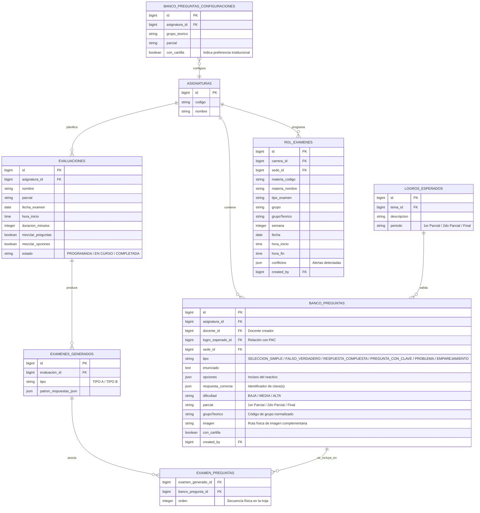
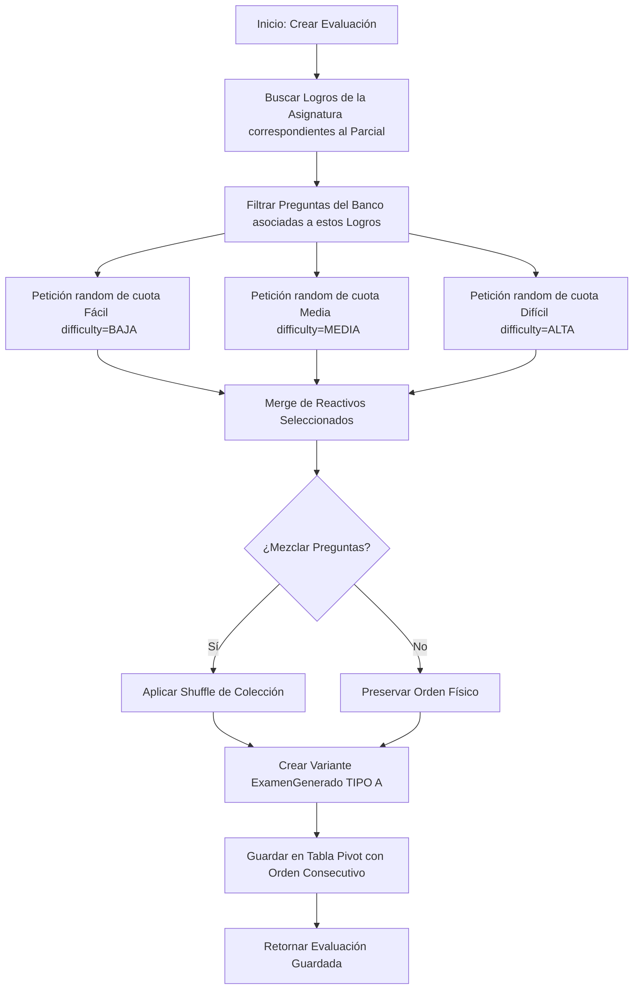

# Módulo 7: Banco de Preguntas y Evaluaciones (SISA 2.0)

Este módulo gestiona la creación de reactivos y la estructuración automatizada de evaluaciones. Permite la importación masiva de bancos de preguntas desde plantillas de Excel, el control de la directiva institucional de "Cartillas de Examen" y la generación inteligente de exámenes aleatorios balanceados por dificultad. Asimismo, implementa el flujo de asignación del "Rol de Exámenes" por sede/carrera y protege la integridad de los resultados mediante bloqueos temporales criptográficos.

---

## 1. Ficha Técnica

*   **Backend:** Laravel v12.x + PHP v8.2+ + Eloquent ORM + PhpSpreadsheet (Parseo de Excel) + Smalot PdfParser (Extracción opcional de PDFs).
*   **Frontend UI:** Quasar Framework v2.x + Vue 3 (Composition API).
*   **Gestión de Estado:** Pinia Stores (`preguntas.js` y `rolExamenes.js`).
*   **Controladores Backend:** `App\Http\Controllers\BancoPreguntaController`, `App\Http\Controllers\EvaluacionController`, `App\Http\Controllers\RolExamenController`.
*   **Regla de Seguridad de Fugas:** Retardo de 3 horas para la publicación y descarga del PDF del patrón de respuestas oficiales.

---

## 2. Arquitectura de Datos (ER)

El banco de preguntas se organiza jerárquicamente a nivel de asignatura y se mapea con los logros esperados definidos en el PAC para garantizar la validez de contenido de las pruebas.



---

## 3. Especificación de la API (Endpoints)

El sistema expone endpoints para la gestión granular, importaciones en lote, y la orquestación del generador de pruebas.

### 3.1 Importación Masiva desde Excel (Upload Banco)
Parsea un archivo `.xlsx` estructurado por columnas fijas.
*   **Método:** `POST`
*   **Ruta:** `/api/banco-preguntas/import`
*   **Headers:** `Content-Type: multipart/form-data`, `Authorization: Bearer <token>`
*   **Campos en el Body:**
    *   `file`: Archivo binario Excel.
    *   `asignatura_id`: (int) ID de la asignatura destino.
    *   `parcial`: (string) `"1er Parcial" | "2do Parcial" | "Final"`
    *   `grupoTeorico`: (string) `"G1" | "A" | "B"` (Opcional)
    *   `con_cartilla`: (boolean) Preestablece la preferencia de cartilla.
    *   `modo`: (string) `"agregar" | "reemplazar"`. Si es `"reemplazar"`, limpia las preguntas anteriores del docente y grupo antes del volcado.
*   **Response de Éxito (`200 OK`):**
    ```json
    {
      "success": true,
      "message": "Se han importado 25 preguntas nuevas correctamente.",
      "total": 27,
      "evaluables": 25,
      "auxiliares": 2,
      "omitidas": 1
    }
    ```

### 3.2 Generación Automática de Examen (Store Evaluacion)
Crea una evaluación programada seleccionando aleatoriamente preguntas que correspondan al parcial basándose en la ponderación de dificultades solicitada por el usuario.
*   **Método:** `POST`
*   **Ruta:** `/api/evaluaciones`
*   **Request (JSON):**
    ```json
    {
      "asignatura_id": 8,
      "nombre": "Examen Parcial de Anatomía",
      "parcial": "1er Parcial",
      "fecha_examen": "2026-05-24",
      "hora_inicio": "08:15",
      "duracion_minutos": 90,
      "distribucion_facil": 5,
      "distribucion_medio": 3,
      "distribucion_dificil": 2,
      "mezclar_preguntas": true,
      "mezclar_opciones": true
    }
    ```
*   **Response de Éxito (`201 Created`):**
    ```json
    {
      "id": 19,
      "nombre": "Examen Parcial de Anatomía",
      "parcial": "1er Parcial",
      "estado": "PROGRAMADA",
      "examenes_generados": [
        {
          "id": 41,
          "evaluacion_id": 19,
          "tipo": "TIPO A"
        }
      ]
    }
    ```

### 3.3 Obtener Patrón de Respuestas (PDF / JSON)
Recupera el listado estructurado de respuestas para impresión física de la plantilla de calificación.
*   **Método:** `GET`
*   **Ruta:** `/api/evaluaciones/patron/{examen_generado_id}`
*   **Seguridad Activa (3-Hour Lock):** Si el docente o alumno intenta consultar el patrón antes del tiempo oficial de finalización (definido como **hora de inicio del examen + 3 horas**), la API aborta con un código `403 Forbidden`.
*   **Response Temprana (`403 Forbidden`):**
    ```json
    {
      "error": "El patrón estará disponible a las 11:15 24/05/2026"
    }
    ```
*   **Response Exitosa (`200 OK`):**
    ```json
    {
      "institucion": "UNIVERSIDAD TÉCNICA PRIVADA COSMOS",
      "carrera": "Medicina",
      "asignatura": "Anatomía I",
      "examen_titulo": "1er Parcial",
      "tipo_examen": "TIPO A",
      "fecha": "2026-05-24",
      "preguntas": [
        { "numero": 1, "respuesta_correcta": "A", "opciones": [...] },
        { "numero": 2, "respuesta_correcta": "C", "opciones": [...] }
      ]
    }
    ```

---

## 4. Dinámicas y Algoritmos Core

### 4.1 Reglas del Motor de Importación y De-duplicación

El método `BancoPreguntaController::import()` ejecuta una serie de validaciones estrictas campo por campo:
1.  **Estructura del Libro:** Busca la pestaña llamada exactamente **`Banco`** (o en su defecto, la primera hoja que contenga las celdas de encabezado `"TIPO"` y `"ENUNCIADO"`).
2.  **Notas de Carga:** El parser barre las filas de arriba a abajo. Si detecta una celda que diga `"NOTAS DE CARGA"`, descarta inmediatamente esa fila y todas las subsiguientes, previniendo la importación de textos de guía o explicativos de la plantilla.
3.  **Restricciones de Reactivos:**
    *   **Preguntas Evaluables (`SELECCION_SIMPLE`, `FALSO_VERDADERO`, `RESPUESTA_COMPUESTA`, `PREGUNTA_CON_CLAVE`):** Obligatoriamente requieren definir columna de **Dificultad** (1/BAJA, 2/MEDIA, 3/ALTA) y **Respuesta Correcta**. En caso de ausencia, aborta el procesamiento con error descriptivo.
    *   **Preguntas Auxiliares (`PROBLEMA`, `EMPAREJAMIENTO`):** No contienen respuesta directa ni dificultad (estas se definen en los incisos hijos). El parser valida que estas columnas estén **completamente vacías**, rechazando el archivo ante inconsistencias.
    *   **Respuesta Compuesta:** Valida que contenga exactamente **4 incisos** (A, B, C, D) y la clave sea una única letra en ese rango.
    *   **Pregunta con Clave:** Valida exactamente **4 incisos** y una clave de respuesta entre A y E.
4.  **Normalización e Inteligencia de Duplicados:**
    Para evitar la duplicación de preguntas al re-subir la plantilla, el sistema calcula una firma SHA/String única por reactivo (`construirClaveDuplicadoBanco`):
    ```php
    // Remueve etiquetas HTML, espacios múltiples, acentos y normaliza el texto a mayúsculas
    $clave = $enunciado_limpio . '||' . $grupo_teorico_limpio . '||' . $parcial_normalizado;
    ```
    Si esta clave ya existe en el banco actual del docente para esa materia, la omite silenciosamente y prosigue con la siguiente fila, reportándolo al finalizar como `omitidas`.

### 4.2 La Preferencia Institucional: "Cartillas de Examen"
Para regular la calidad pedagógica, UNITEPC cuenta con la directiva **Cartillas de Examen**:
*   Si se establece `con_cartilla = true`, el docente debe obligatoriamente subir su banco de reactivos al sistema para permitir la generación oficial.
*   Si se configura `con_cartilla = false` (a través de `/api/banco-preguntas/config`), el sistema asume que el examen se elaborará manualmente por vías físicas. **Acción en Cascada:** Al marcar una materia como *Sin Cartilla*, el controlador ejecuta un borrado total preventivo (`destroyByFiltro`) de las preguntas e imágenes previas de ese grupo en la base de datos para optimizar recursos de almacenamiento.

---

## 5. El Generador Aleatorio Inteligente (Backend Deep-Dive)

La asignación de reactivos de `EvaluacionController::store` selecciona aleatoriamente preguntas válidas del banco de la asignatura cruzándolas con los logros esperados y balanceando la dificultad según las cuotas definidas.



---

## 6. Mapeo y Auditoría del Rol de Exámenes (`RolExamenController`)

El control del calendario de exámenes reside en `RolExamenController`. Al importar el calendario oficial de la sede (un archivo Excel masivo por carrera):

1.  **Limpieza Previa Segmentada:** El backend ejecuta una purga selectiva eliminando registros anteriores únicamente de la carrera, sede e inicio de gestión especificados.
2.  **Validación de Reglas del Calendario:**
    *   **Validación de Semanas:** Compara la semana cargada contra los márgenes pedagógicos del semestre (1er Parcial: semanas 7 a 9; 2do Parcial: 14 a 16; Final: 18 a 20). En caso de desfase, guarda una advertencia en la celda `conflictos.semana`.
    *   **Validación de Día de Clase:** Verifica que el día de la semana programado coincida con alguno de los días en que el grupo tiene clases teóricas en la tabla `horarios`. Si no coincide, alerta `conflictos.horario` ("El examen es Lunes pero el grupo pasa clase Martes/Jueves").
    *   **Colisiones:** Evita que estudiantes del mismo semestre y carrera rindan más de una evaluación en la misma fecha oficial.
3.  **La Vista del Docente (`MisEvaluacionesPage.vue`):**
    El docente accede a su portal personal. El sistema localiza los códigos de materia y paralelo a su cargo y realiza un cruce en cascada con el plan del `RolExamen`. Retorna los exámenes formateados e indica en tiempo real su estado activo:
    *   `Programada`: Hora actual previa al inicio.
    *   `En Curso`: Hora actual comprendida entre el inicio y las 2 horas de tolerancia.
    *   `Completada`: Superado el umbral del examen.

---

## 7. Plan de Contingencia y Capacidad Offline

Dado que el banco de preguntas y las evaluaciones son transacciones críticas y sujetas a estrictas regulaciones académicas, se aplican los siguientes mecanismos de resiliencia desconectada:

> [!NOTE]
> La creación de bancos, edición de reactivos y generación de variantes de exámenes se consideran **operaciones puramente Online**. Sin embargo, la consulta y preparación de evaluaciones cuentan con soporte offline.

*   **Caché de Banco Local:** El almacén Pinia `preguntas.js` descarga y retiene en local la cartilla de preguntas validadas de la materia en uso. El docente puede revisar la redacción de los incisos o planificar sus clases sin necesidad de internet en el aula.
*   **Descarga de Hojas de Examen Pre-cargadas:** El sistema permite pre-visualizar el Patrón Tipo A y la hoja del estudiante, guardando los datos estructurados en la persistencia móvil. Si al momento de tomar la prueba presencial la sede universitaria sufre un apagón o caída de red, el docente puede visualizar la hoja del examen renderizada en su dispositivo móvil/tablet para dictarla o proyectarla localmente.
