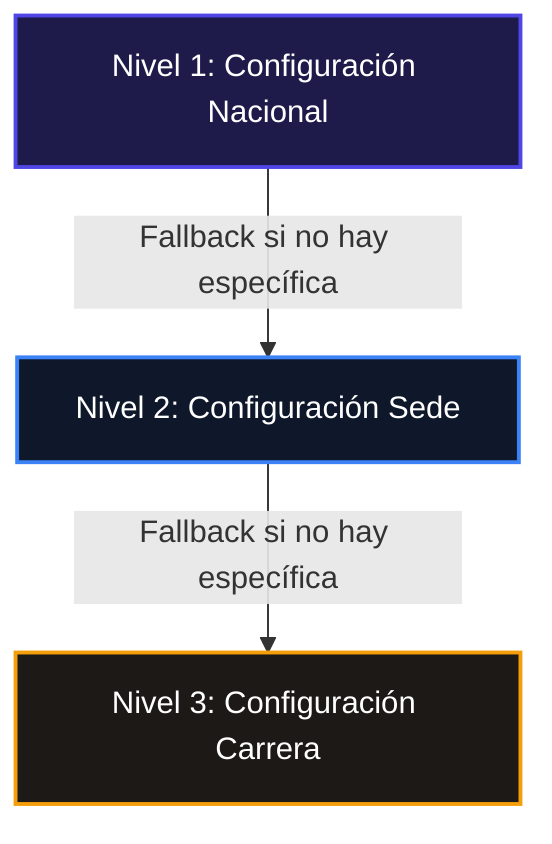
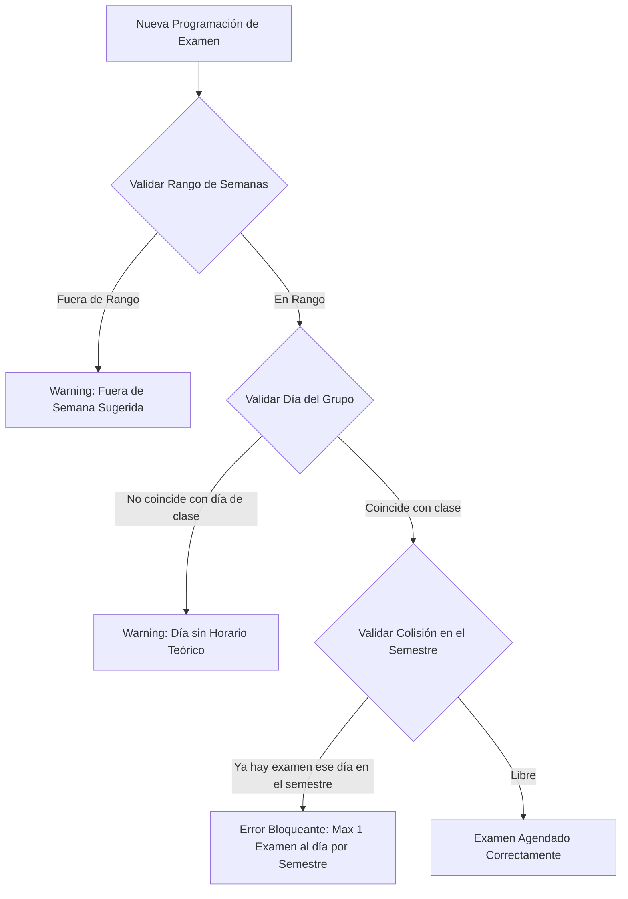

# Módulo 8: Gestión de Evaluaciones y Rol de Exámenes (SISA 2.0)

Este módulo describe la arquitectura, la lógica del lado del cliente y los servicios del backend que gobiernan la **administración de evaluaciones** (configuración jerárquica) y el **Rol de Exámenes** (grilla interactiva de calendarización con validaciones duras en tiempo real).

---

## 1. Ficha Técnica

- **Tecnología del Frontend:** Quasar Framework v2.x + Vue 3 (Composition API) + Pinia (Gestor de Estado).
- **Vistas de Frontend:**
  - `src/pages/admin/AdministracionEvaluacionPage.vue` (Administración de directivas).
  - `src/pages/admin/EvaluacionesPage.vue` (Listado y control de evaluaciones).
  - `src/pages/director/RolExamenesPage.vue` (Grilla de calendarización para directores).
  - `src/pages/evaluaciones/RolExamenesEvaluacionPage.vue` (Vistas de evaluaciones del departamento).
- **Tecnología del Backend:** Laravel v12.x + PHP 8.2+ + Eloquent ORM + Form Requests.
- **Controladores Backend:**
  - `App\Http\Controllers\EvaluacionConfiguracionController` (Jerarquías y fallbacks).
  - `App\Http\Controllers\RolExamenController` (Calendarización, reglas de choque y cargas masivas).

---

## 2. Administración de Evaluaciones (`adm.Evaluaciones`)

El submódulo `adm.Evaluaciones` permite regular de forma jerárquica y centralizada los parámetros y directivas institucionales que rigen la creación de evaluaciones en UNITEPC.

### 2.1 Modelo de Configuración Jerárquica y Fallback

Las políticas no son necesariamente homogéneas a nivel nacional. Por ello, el sistema implementa un árbol de herencia/especificidad con tres niveles:



Al solicitar los parámetros para un docente y grupo de una materia, el backend ejecuta la función estática `EvaluacionConfiguracion::obtenerConfiguracionEfectiva($sedeId, $carreraId)` que opera bajo las siguientes reglas:

1.  **Busca Carrera:** Si existe una fila específica para la combinación `sede_id` y `carrera_id` con `nivel = 'carrera'`, retorna dicha configuración.
2.  **Busca Sede:** Si no se encuentra, busca una fila para `sede_id` con `nivel = 'sede'` y `carrera_id = null`.
3.  **Aplica Nacional (Raíz):** En caso de ausencia de las anteriores, hereda la fila genérica con `nivel = 'nacional'`, `sede_id = null`, `carrera_id = null`.

### 2.2 Estructura JSON de la Configuración (`configuracion`)

Los parámetros del examen se almacenan en un campo estructurado de tipo `JSON` en la tabla `evaluacion_configuraciones`:

```json
{
  "duracion_minutos_defecto": 90,
  "tolerancia_ingreso_minutos": 15,
  "mezclar_preguntas": true,
  "mezclar_opciones": true,
  "preguntas_total": 10,
  "distribucion_dificultad": {
    "facil": 4,
    "medio": 4,
    "dificil": 2
  },
  "permite_cartilla_virtual": true,
  "publicacion_patron_demora_horas": 3
}
```

> [!IMPORTANT]
> **Regla de Validación Balanceada:**
> Al guardar una configuración en `guardarConfiguracion` (vía `EvaluacionConfiguracionController`), el sistema valida de manera dura en el backend que la suma de reactivos de dificultad:
> $$\text{facil} + \text{medio} + \text{dificil} = \text{preguntas\_total}$$
> En caso de discrepancia, el servidor aborta la transacción y responde con un código `422 Unprocessable Entity` para evitar inconsistencias en el motor de selección aleatoria.

### 2.3 Detalle de Endpoints de Configuración

#### Obtener Configuración Efectiva

- **Método:** `GET`
- **Ruta:** `/api/evaluaciones/configuracion`
- **Query Params:**
  - `nivel`: `"nacional" | "sede" | "carrera"` (Nivel a consultar)
  - `sede_id`: (int, opcional) ID de la sede
  - `carrera_id`: (int, opcional) ID de la carrera
- **Response (`200 OK`):**
  ```json
  {
    "success": true,
    "configuracion": {
      "duracion_minutos_defecto": 90,
      "tolerancia_ingreso_minutos": 15,
      "mezclar_preguntas": true,
      "mezclar_opciones": true,
      "preguntas_total": 10,
      "distribucion_dificultad": {
        "facil": 4,
        "medio": 4,
        "dificil": 2
      }
    },
    "nivel_hallado": "sede",
    "es_propia": true
  }
  ```

#### Guardar/Actualizar Configuración

- **Método:** `POST`
- **Ruta:** `/api/evaluaciones/configuracion`
- **Payload (JSON):**
  ```json
  {
    "nivel": "sede",
    "sede_id": 2,
    "carrera_id": null,
    "configuracion": {
      "duracion_minutos_defecto": 90,
      "tolerancia_ingreso_minutos": 10,
      "mezclar_preguntas": true,
      "mezclar_opciones": true,
      "preguntas_total": 20,
      "distribucion_dificultad": {
        "facil": 8,
        "medio": 8,
        "dificil": 4
      }
    }
  }
  ```
- **Response (`200 OK`):**
  ```json
  {
    "success": true,
    "message": "Configuración de evaluaciones guardada correctamente."
  }
  ```

---

## 3. Rol de Exámenes (Calendarización de Evaluaciones)

El **Rol de Exámenes** es el módulo centralizado para programar de forma estricta las fechas, bloques horarios, aulas y paralelos de todos los parciales. A diferencia de las planificaciones comunes, el Rol de Exámenes implementa validaciones cruzadas críticas para impedir choques horarios de docentes, alumnos e infraestructura.



### 3.1 Motor de Reglas y Validación de Choques (`validateExamRules`)

Antes de agendar un examen (vía creación manual o importación de plantilla general), el sistema ejecuta el motor interno `validateExamRules` en el backend. Este analiza tres restricciones:

#### 1. Rango de Semanas Académicas Sugeridas

El sistema parametriza los rangos de semanas del calendario semestral (20 semanas en total) de acuerdo al tipo de parcial:

| Tipo de Parcial   | Rango de Semanas Válidas   | Estado de Restricción          |
| ----------------- | -------------------------- | ------------------------------ |
| **1er Parcial**   | Semanas $7 \text{ a } 9$   | Alerta (Warning No-Bloqueante) |
| **2do Parcial**   | Semanas $14 \text{ a } 16$ | Alerta (Warning No-Bloqueante) |
| **Final**         | Semanas $18 \text{ a } 20$ | Alerta (Warning No-Bloqueante) |
| **2da Instancia** | Semanas $21 \text{ a } 25$ | Alerta (Warning No-Bloqueante) |

Si el examen se programa en una semana diferente, se inyecta en el objeto `conflictos` la advertencia `"Fuera de semana sugerida (Semanas X-Y)"`.

#### 2. Validación de Día de Clase Efectivo

Para evitar que se convoque a los estudiantes en horarios fuera de su rutina académica convencional, el sistema recupera los horarios registrados para el grupo teórico (`tipo = 'TEORICO'`).

- Extrae el día de la semana de la fecha propuesta (ej. `2026-05-20` es miércoles $\rightarrow$ día `3`).
- Normaliza los nombres de los días de la base de datos locales (ej: `"Miercoles"`, `"miércoles"`, `"MIE"` $\rightarrow$ `3`).
- **Acción:** Si el examen se agenda en un día en el cual el paralelo no tiene clases teóricas registradas, añade el warning: `"El examen es el [Día], pero el grupo no tiene horario teórico ese día."`.

#### 3. Regla Estricta de Sobrecarga de Estudiantes (Colisiones de Semestre)

Es una directiva de la Vicerrectoría Académica que **ningún estudiante de un mismo semestre y carrera rinda más de un examen parcial por día**.

- **Algoritmo de Detección:**
  1.  Identifica la asignatura que se intenta calendarizar y recupera el semestre del plan al que pertenece (vía relación de pivote en `asignatura_carrera` para el `carrera_id` provisto).
  2.  Busca registros existentes en `rol_examenes` para la misma `carrera_id`, la misma `fecha` y el mismo semestre curricular.
  3.  **Acción Bloqueante:** Si encuentra colisiones, se detiene la inserción y retorna: `"Ya existe otro examen programado para el semestre [S] en la fecha [F]. (Restricción: Máx 1 examen por día para el mismo semestre)"`.

### 3.2 Endpoints del Rol de Exámenes

#### Listar Rol de Exámenes Filtrado

- **Método:** `GET`
- **Ruta:** `/api/rol-examenes`
- **Query Params:** `sede_id`, `carrera_id`, `gestion`, `semestre`, `tipo_examen`
- **Response (`200 OK`):**
  ```json
  [
    {
      "id": 84,
      "materia_codigo": "MED-201",
      "materia_nombre": "Fisiología Humana",
      "tipo_examen": "2do Parcial",
      "grupo": "G1",
      "semana": 14,
      "fecha": "2026-06-03",
      "hora_inicio": "08:00:00",
      "hora_fin": "09:30:00",
      "conflictos": {
        "horario": "El examen es el Miércoles, pero el grupo no tiene horario teórico ese día."
      }
    }
  ]
  ```

#### Crear Examen Individual Manual

- **Método:** `POST`
- **Ruta:** `/api/rol-examenes`
- **Payload:**
  ```json
  {
    "gestion": "I-2026",
    "carrera_id": 3,
    "sede_id": 1,
    "materia_codigo": "MED-201",
    "materia_nombre": "Fisiología Humana",
    "tipo_examen": "2do Parcial",
    "semana": 14,
    "fecha": "2026-06-03",
    "hora_inicio": "08:00",
    "hora_fin": "09:30"
  }
  ```
- **Response de Inserción Fallida por Colisión (`422 Unprocessable`):**
  ```json
  {
    "message": "Ya existe otro examen programado para el semestre 3 en la fecha 2026-06-03. (Restricción: Máx 1 examen por día para el mismo semestre)"
  }
  ```

---

## 4. Flujo de Trabajo en la Interfaz de Usuario

### 4.1 Pantalla de Configuración General

En `AdministracionEvaluacionPage.vue`, el administrador selecciona la sede y la carrera. El frontend invoca `/api/evaluaciones/configuracion` y pinta el formulario interactivo:

1.  **Selectores en cascada:** Sedes nacionales y sus correspondientes carreras activas.
2.  **Parámetros reactivos:** Si se modifica `preguntas_total`, un watcher de Vue valida dinámicamente y distribuye las cantidades sugiriendo pesos por defecto en dificultades (ej: $40\%$ fácil, $40\%$ medio, $20\%$ difícil).
3.  **Herencia Visual:** Muestra un badge dinámico ("Heredado de Nacional" o "Configuración Local") basándose en el campo `nivel_hallado` provisto por el backend.

### 4.2 Grilla de Programación de Exámenes

En `RolExamenesPage.vue`, el Director de Carrera programa el rol semestral mediante una grilla temporal de planificación:

- Visualiza en celdas de colores los exámenes agendados.
- **Indicadores de Advertencia:** Las celdas con advertencias (warnings) de semanas o discordancia de horario de clase se marcan con bordes naranjas y un tooltip que despliega el JSON formateado de `conflictos`.
- **Bloqueos Visuales:** Si intenta arrastrar o guardar un examen en una fecha colisionada (mismo semestre, mismo día), la grilla rechaza el cambio y despliega un diálogo de rechazo Toast con el mensaje de error provisto por el motor Laravel.
