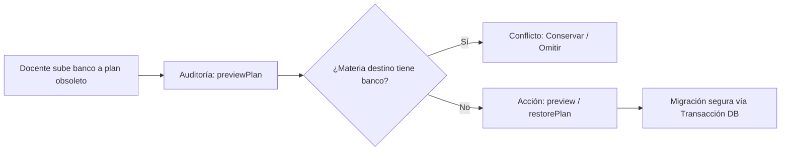
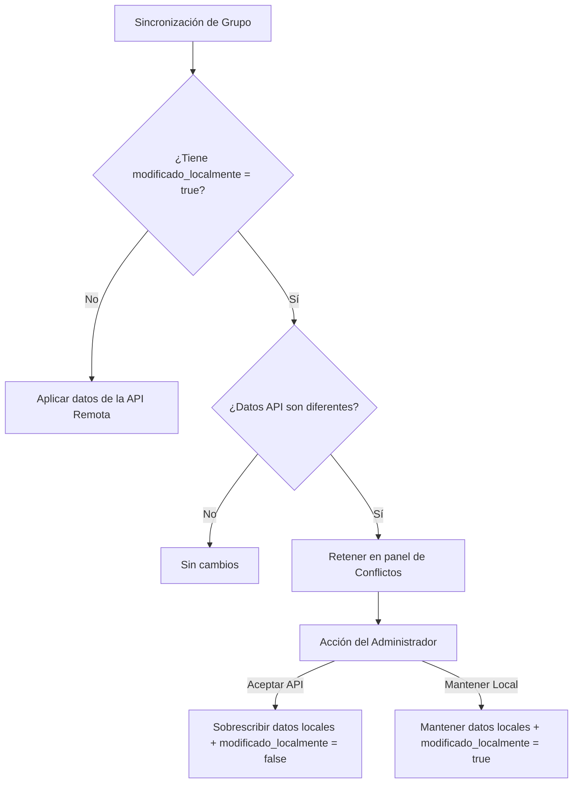
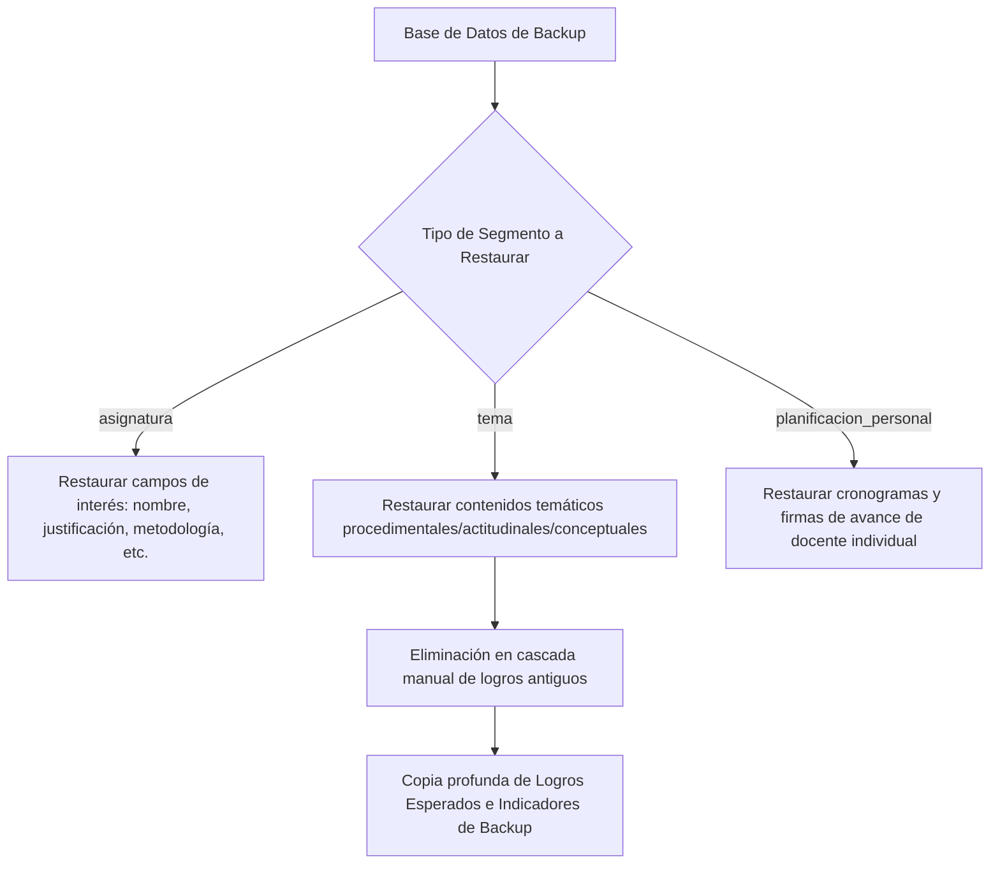

# Módulo 9: Sincronización de Datos y Motores de Comparación (SISA 2.0)

Este módulo detalla los mecanismos técnicos, flujos de datos, controladores y vistas que gobiernan el **Módulo de Sincronización Académica** con la API externa de planificación centralizada, el **Desacoplamiento de Bancos de Preguntas** (sin logros esperados), y la suite de motores analíticos de comparación: **Engine 1 (Verificador Lexical de PDF)** y **Engine 2 (Comparador de Respaldos de Base de Datos)**.

---

## 1. Ficha Técnica y Estructura Arquitectural

*   **Vistas en el Frontend (Quasar + Vue 3):**
    *   `src/pages/admin/SincronizacionPage.vue` (Panel interactivo de sincronización y logs).
    *   `src/pages/admin/ComparacionSincronizacionPage.vue` (Visualizador de diferencias pre/post sincronización).
    *   `src/pages/admin/AuditoriaBancoPlanPage.vue` (Gestión de bancos asignados a planes erróneos).
    *   `src/pages/admin/ComparadorBackupPage.vue` (Comparador y restaurador granular de bases de datos).
*   **Controladores en el Backend (Laravel v12.x):**
    *   `App\Http\Controllers\SyncController` (Sincronización API, snapshots e instantáneas).
    *   `App\Http\Controllers\RestauracionBancosController` (Resolución de bancos de preguntas huérfanas y reasignación por plan).
    *   `App\Http\Controllers\BackupComparisonController` (Comparación de esquemas y restauración granular segmentada).
    *   `App\Http\Controllers\RolExamenController` (Métodos de escaneo de hojas de examen en PDF y verificación lexical contra reactivos).

---

## 2. Banco de Preguntas sin Logros Esperados (Desacoplamiento)

En versiones anteriores de SISA, los reactivos del banco de preguntas dependían obligatoriamente de la estructura curricular de competencias a través del campo `logro_esperado_id`. SISA 2.0 implementa una arquitectura desacoplada para dar soporte a reactivos autónomos e independientes.

### 2.1 Modificaciones del Esquema de Datos (`banco_preguntas`)

El campo `logro_esperado_id` en la tabla `banco_preguntas` se ha modificado para admitir valores nulos (`nullable`), permitiendo que las preguntas existan desvinculadas de logros temáticos específicos, pero enlazadas directamente a la asignatura (`asignatura_id`), docente (`docente_id`) y período evaluativo (`parcial`).

```sql
ALTER TABLE banco_preguntas MODIFY COLUMN logro_esperado_id INT NULL;
```

### 2.2 Auditoría y Traslación de Planes (`AuditoriaBancoPlanPage.vue`)

Dado que los docentes frecuentemente registran reactivos en asignaturas con el mismo código pero bajo mallas curriculares o planes de estudios obsoletos, se implementó una herramienta de auditoría interactiva. 

Esta herramienta detecta "bancos huérfanos" (preguntas guardadas en un plan inactivo) y permite la migración masiva y controlada de preguntas al plan curricular vigente.



### 2.3 Detalle de Endpoints de Traslación (`restauracion/bancos-plan`)

Estos endpoints requieren el rol de `ADMIN` o `SUPER_ADMIN`.

#### Vista Previa de Inconsistencias (Preview)
*   **Método:** `POST`
*   **Ruta:** `/api/restauracion/bancos-plan/preview`
*   **Payload:**
    ```json
    {
      "sede_id": 1,
      "carrera_id": 3,
      "parcial": "2do Parcial",
      "codigo": "MED-201"
    }
    ```
*   **Response (`200 OK`):**
    ```json
    {
      "ok": true,
      "sede_id": 1,
      "carrera_id": 3,
      "parcial": "2do Parcial",
      "resumen": {
        "grupos_revisados": 12,
        "materias_detectadas": 1,
        "grupos_detectados": 2,
        "hallazgos": 2,
        "restaurables": 2,
        "conflictos": 0,
        "sin_grupo_actual": 0,
        "preguntas_otro_plan": 45,
        "preguntas_plan_correcto": 0
      },
      "detalles": [
        {
          "key": "MED-201|12|G1",
          "codigo": "MED-201",
          "docente_id": 12,
          "docente_nombre": "Dr. Juan Pérez",
          "grupo_teorico": "G1",
          "asignatura_origen_id": 105,
          "plan_origen": "2018",
          "asignatura_destino_id": 204,
          "plan_destino": "2024",
          "preguntas_otro_plan": 25,
          "preguntas_plan_correcto": 0,
          "estado": "restaurable"
        }
      ]
    }
    ```

#### Ejecutar Restauración/Traslación (Restore)
*   **Método:** `POST`
*   **Ruta:** `/api/restauracion/bancos-plan/restore`
*   **Payload:** Envía los items seleccionados para migrar sus preguntas al plan destino.
    ```json
    {
      "items": [
        {
          "sede_id": 1,
          "carrera_id": 3,
          "docente_id": 12,
          "grupo_teorico": "G1",
          "parcial": "2do Parcial",
          "asignatura_origen_id": 105,
          "asignatura_destino_id": 204
        }
      ]
    }
    ```
*   **Response (`200 OK`):**
    ```json
    {
      "ok": true,
      "total_procesadas": 1,
      "restauradas": 1,
      "ya_correctas": 0,
      "sin_consenso": 0,
      "cambios": [
        {
          "item": "MED-201|12|G1",
          "status": "restaurada",
          "cantidad_preguntas_migradas": 25
        }
      ]
    }
    ```

---

## 3. Módulo de Sincronización Académica Externa

El sistema se sincroniza periódicamente con una API de planificación centralizada (`http://181.188.185.211:9098/api/Grupos/listar/`) para actualizar sedes, carreras, asignaturas, paralelos (grupos), docentes y horarios convencionales.

### 3.1 Captura de Snapshots y Generación de Diferencias (`generarDiff`)

Para proteger la integridad de los datos locales (como planificaciones de clases y asistencias ya registradas), la sincronización opera mediante instantáneas pre y post ejecución:

1.  **Instantánea Previa (`capturarSnapshot`):** Al iniciar, el backend captura un snapshot en memoria estructurado con el estado actual de la sede y carrera seleccionada (lista de grupos activos, docentes asociados y arreglos horarios).
2.  **Llamada y Lotes (Chunking):** La API externa es consultada de forma asíncrona. Los registros remotos se procesan recursivamente y se actualizan en la base de datos local.
3.  **Instantánea Posterior (`capturarSnapshot`):** Se genera un snapshot idéntico inmediatamente después de la sincronización.
4.  **Generador de Diff (`generarDiff`):** El sistema compara analíticamente ambos objetos temporales para identificar y guardar en logs:
    *   `grupos_nuevos` (Creados remotamente).
    *   `grupos_eliminados` (Inactivados en API central).
    *   `grupos_docente_cambio` (Reasignación de docente titular).
    *   `grupos_horario_cambio` (Variación en bloque de horas o aulas).
    *   `horarios_eliminados` (Reducción de carga teórica semanal).
    *   `docentes_nuevos` y `asignaturas_nuevas`.

### 3.2 Estrategia de Resolución de Conflictos Local vs API

Cuando un Director de Carrera realiza una modificación manual en SISA (por ejemplo, asigna un docente interino en un paralelo), el registro local se marca con la bandera `modificado_localmente = true`.

Al realizar una sincronización posterior, si el sistema detecta que la API central tiene un dato diferente para ese grupo, se genera un conflicto retenido. En `SincronizacionPage.vue` se listan estas discrepancias, permitiendo al administrador resolverlas mediante dos políticas de resolución:

| Opción de Resolución | Endpoint payload (`accion`) | Efecto Técnico en el Backend |
|---|---|---|
| **Aceptar API** | `"aceptar_api"` | Sobrescribe los campos del paralelo local con los datos provistos por la API remota. Apaga la bandera marcando `modificado_localmente = false`. |
| **Mantener Local** | `"mantener_local"` | Preserva el registro local con la bandera `modificado_localmente = true`. Los futuros ciclos de sincronización omitirán actualizar este registro automáticamente para resguardar la decisión manual. |



### 3.3 Endpoints del Engine de Sincronización (`sync`)

Requiere rol `SUPER_ADMIN`.

#### Iniciar Sincronización por Sede
*   **Método:** `POST`
*   **Ruta:** `/api/sync/sede`
*   **Payload:** `{"sede_id": 1}`
*   **Response (`200 OK`):** Retorna el resumen del diff generado.

#### Resolver Conflicto de Datos
*   **Método:** `POST`
*   **Ruta:** `/api/sync/resolver-conflictos`
*   **Payload:**
    ```json
    {
      "grupo_id": 504,
      "accion": "aceptar_api",
      "docente_ci_api": "3498201"
    }
    ```
*   **Response (`200 OK`):**
    ```json
    {
      "success": true,
      "mensaje": "Conflicto resuelto: se aceptaron los datos de la API."
    }
    ```

---

## 4. Comparador de Patrones - Engine 1: Verificador Lexical de PDF

El **Engine 1** es un motor de análisis léxico diseñado para auditar exámenes resueltos impresos/digitales en formato PDF y comprobar su concordancia exacta contra las variantes autorizadas (TIPO A, TIPO B, TIPO C, TIPO D) que se encuentran registradas en los bancos del sistema.

### 4.1 Extracción de Texto y Algoritmo de Similitud Léxica

1.  **Parseo de PDF:** El backend procesa el archivo subido extrayendo cadenas de texto plano estructurado mediante la biblioteca del parseador de PDF de PHP.
2.  **Normalización de Texto (`normalizeComparableText`):**
    *   Convierte todos los caracteres a mayúsculas (`UPPER`).
    *   Elimina acentos y diacríticos (ej: `á` $\rightarrow$ `A`, `ñ` $\rightarrow$ `N`).
    *   Suprime espacios en blanco múltiples, retornos de carro, tabulaciones y caracteres especiales no alfanuméricos.
3.  **Comparación por `similar_text()`:**
    El sistema recupera los reactivos vigentes asignados al docente, la materia y el parcial. Luego, ejecuta una comparación iterativa cruzada:
    ```php
    similar_text($pdfComparable, $statementComparable, $percent);
    ```
    *   **Heurística de Subcadenas:** Si el enunciado del banco se encuentra textualmente dentro del bloque extraído del PDF (o viceversa), se asigna de manera forzada un porcentaje mínimo de **92%** de similitud.
    *   **Umbral Mínimo:** Solo los emparejamientos que reportan una similitud léxica superior o igual al **38%** son aceptados como coincidencias válidas de pregunta.

### 4.2 Derivación de la Clave de Variante y Respuestas Esperadas

Una vez que se localiza un reactivo coincidente en el PDF, el motor decodifica la opción seleccionada por el estudiante:

1.  **Identificación de Opciones Visibles:**
    Aplica una expresión regular sobre el bloque de texto del PDF para extraer las letras y el contenido de las opciones múltiples:
    ```regex
    /\b([A-E])\)\s*(.*?)(?=\s+[A-E]\)\s*|$)/u
    ```
2.  **Resolución de Opción Correcta (`deriveExpectedAnswerFromPdfBlock`):**
    *   Para preguntas de `SELECCION_SIMPLE` o `SUBPROBLEMA`, recupera la opción correcta registrada en la base de datos (`respuesta_correcta`).
    *   Normaliza el texto de dicha opción correcta.
    *   Compara el texto de la opción correcta contra cada una de las opciones extraídas del PDF (`A`, `B`, `C`, `D`, `E`) utilizando nuevamente `similar_text()`.
    *   **Umbral de Opción:** Si encuentra una coincidencia de texto con una similitud superior o igual al **50%**, infiere que esa letra representa la respuesta correcta en la hoja impresa del estudiante.
3.  **Generación de la Grilla de Patrón:**
    Al concluir el escaneo, el sistema devuelve una matriz detallada que empareja el número físico de pregunta en el PDF, el ID de reactivo en la base de datos local y la letra correspondiente a la opción correcta del examen impreso.

---

## 5. Comparador de Base de Datos de Respaldo - Engine 2

El **Engine 2** (`BackupComparisonController`) permite realizar auditorías profundas y restauraciones granulares contra un grupo de cinco bases de datos históricas de respaldo que el sistema mantiene rotativas de forma diaria:

$$\text{academicolunes, academicomartes, academicomiercoles, academicojueves, academicoviernes}$$

### 5.1 Criterios de Selección Dinámica y Filtros Temporales

Al iniciar una comparación, el Director de Carrera o el Administrador selecciona una de las bases de datos de backup. El backend cuenta con mecanismos de clasificación automática del parcial basado en la fecha de creación de los registros:

*   **Fecha de Corte (`CORTE_2DO_PARCIAL`):** Definida estáticamente el `2026-05-08`.
*   **Regla Temporal:** Si los reactivos huérfanos o a auditar registran una fecha de creación (`created_at`) igual o posterior a esta fecha de corte, el sistema los categoriza y procesa automáticamente bajo las directivas del **2do Parcial** en lugar del 1er Parcial, simplificando la auditoría de registros transitorios.

### 5.2 Estructura de Comparación Modular y Restauración Granular (`restoreSegment`)

A través de `ComparadorBackupPage.vue`, el usuario visualiza una interfaz interactiva en paralelo (Diff Side-by-Side) que resalta las discrepancias en rojo y verde. La restauración no es de tipo "todo o nada"; se realiza de manera granular a nivel de registro a través del método `/api/backups/restore` (`restoreSegment`), permitiendo recuperar únicamente partes sanas:



### 5.3 Tabla de Endpoints del Comparador de Respaldo

Todos los endpoints están protegidos bajo middleware de autenticación y requieren privilegios administrativos.

| Endpoint | Método | Parámetros Clave | Propósito Técnico |
|---|---|---|---|
| `/api/backups/list` | `GET` | Ninguno | Escanea la base de datos de MySQL buscando nombres con prefijo de base de datos de respaldo y devuelve la lista activa. |
| `/api/backups/search` | `GET` | `backup_db`, `q` | Realiza búsquedas difusas (`LIKE`) de asignaturas registradas dentro de la base de datos de respaldo. |
| `/api/backups/compare` | `POST` | `backup_db`, `codigo`, `current_id`, `backup_id` | Compara asignatura, unidades, temas (y sus logros) entre la base de datos en producción y el respaldo. Devuelve la matriz diff. |
| `/api/backups/restore` | `POST` | `type`, `target_id`, `backup_id`, `backup_db`, `field` (opcional) | Ejecuta el método `restoreSegment` para sobreescribir un fragmento específico resguardando relaciones foráneas. |
