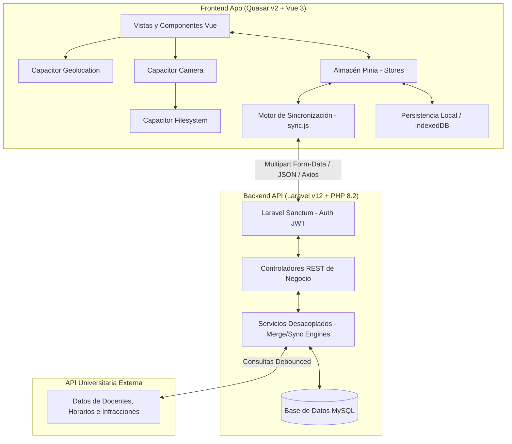

# Documentación Técnica Oficial — SISA 2.0

## Sistema de Documentación y Planificación Académica (UNITEPC)

Bienvenido a la suite de documentación técnica de **SISA 2.0**, la plataforma oficial de la Universidad Técnica Privada Cosmos (UNITEPC) para la gestión integrada, planificación y control académico de sedes nacionales, carreras, materias y evaluaciones.

Esta documentación ha sido elaborada bajo estándares rigurosos de arquitectura de software y escritura técnica, detallando de forma modular cada componente crítico tanto en el backend como en la aplicación móvil/web frontend híbrida.

---

## 1. Entorno Tecnológico y Versiones Oficiales

El ecosistema de SISA 2.0 está construido sobre las siguientes versiones de frameworks y entornos de ejecución validadas en producción:

<<<<<<< HEAD

- **Backend API:** **Laravel v12.x** corriendo bajo **PHP v8.2+** (tipado estricto y optimización de memoria).
- **Base de Datos:** **MySQL v8.0** con almacenamiento estructurado y columnas dinámicas JSON.
- **Frontend SPA / Mobile:** **Quasar Framework v2.x** powered by **Vue 3** (`<script setup>` + Composition API) y empaquetador ultrarrápido **Vite**.
- **Gestor de Estado:** **Pinia Stores** con persistencia local en disco físico.
- **Capa Híbrida Nativa:** **Capacitor v6.x** para acceso a hardware nativo (cámara, sistema de archivos nativo, sensores de georreferenciación y conectividad).
- # **Herramientas Dev:** **CodeGraph** (grafo de conocimiento AST), **OpenCode** (asistente IA), **ESLint + Prettier**, **Vitest + Playwright** (testing), **PHPUnit** (backend).

* **Backend API:** **Laravel v12.x** corriendo bajo **PHP v8.2+** (tipado estricto y optimización de memoria).
* **Base de Datos:** **MySQL v8.0** con almacenamiento estructurado y columnas dinámicas JSON.
* **Frontend SPA / Mobile:** **Quasar Framework v2.x** powered by **Vue 3** (`<script setup>` + Composition API) y empaquetador ultrarrápido **Vite**.
* **Gestor de Estado:** **Pinia Stores** con persistencia local en disco físico.
* **Capa Híbrida Nativa:** **Capacitor v6.x** para acceso a hardware nativo (cámara, sistema de archivos nativo, sensores de georreferenciación y conectividad).
  > > > > > > > bb0efec01818361c4ce30bc06a0acd28515648ff

---

## 2. Mapa Arquitectónico de Sincronización Global

SISA 2.0 implementa una arquitectura híbrida orientada al consumo de microservicios en el backend y una filosofía **Offline-First** resiliente en el cliente móvil, lo que le permite seguir capturando evidencias y planificaciones pedagógicas incluso sin señal de red.



---

## 3. Índice General de Módulos (Documentación Modular)

La documentación se ha estructurado en archivos Markdown independientes por módulo funcional para facilitar su lectura y mantenimiento evolutivo. Puede hacer clic en cada módulo para acceder a su ficha técnica, especificaciones de endpoints, diagramas ERD Mermaid y flujos de trabajo detallados:

<<<<<<< HEAD
| Archivo de Documentación | Módulo Funcional | Enfoque Tecnológico Clave |
|---|---|---|
| **[01. Autenticacion, Seguridad y Perfil](file:///c:/PROYECTOS/SISTEMA%20ACADEMICO/back-2file/documentacion_tecnica/01_autenticacion_seguridad.md)** | Control de acceso, perfiles multi-rol y auditoria. | Laravel Sanctum, Router Guards, interceptores Axios, token cache offline. |
| **[02. Estructura Academica](file:///c:/PROYECTOS/SISTEMA%20ACADEMICO/back-2file/documentacion_tecnica/02_estructura_academica.md)** | Sedes, carreras, campus y mallas curriculares. | Selectores dinamicos en cascada, control jerarquico de sedes y aulas. |
| **[03. PAC y Bibliografia](file:///c:/PROYECTOS/SISTEMA%20ACADEMICO/back-2file/documentacion_tecnica/03_pac_y_bibliografia.md)** | Programa Analitico Curricular, Unidades, Temas y Libros. | Importacion estructurada Word/Excel, validacion de contenidos minimos. |
| **[04. Materias Comunes](file:///c:/PROYECTOS/SISTEMA%20ACADEMICO/back-2file/documentacion_tecnica/04_materias_comunes.md)** | Merge Inteligente de Carpetas Equivalentes. | Algoritmo de scoring, replicacion no destructiva, flags anti-recursion. |
| **[05. Planificacion Semestral](file:///c:/PROYECTOS/SISTEMA%20ACADEMICO/back-2file/documentacion_tecnica/05_planificacion_semestral.md)** | Cronogramas, sesiones y dosificacion de contenidos. | Grid semanal interactivo, auto-salvado debounced, copia de cronogramas. |
| **[06. Control de Clase y Seguimiento](file:///c:/PROYECTOS/SISTEMA%20ACADEMICO/back-2file/documentacion_tecnica/06_control_clase_seguimiento.md)** | Registro de avance offline, firmas y evidencias. | Capacitor Network, Capacitor Filesystem, Blobs/FormData, geocercas. |
| **[07. Banco de Preguntas y Evaluaciones](file:///c:/PROYECTOS/SISTEMA%20ACADEMICO/back-2file/documentacion_tecnica/07_banco_preguntas_evaluaciones.md)** | Gestion de reactivos y generador aleatorio de examenes. | Balanceador de dificultades, de-duplicacion SHA, bloqueo de 3h contra filtraciones. |
| **[08. Gestion de Evaluaciones y Rol de Examenes](file:///c:/PROYECTOS/SISTEMA%20ACADEMICO/back-2file/documentacion_tecnica/08_gestion_evaluaciones_y_examenes.md)** | Directivas de examenes y calendario del Rol de Examenes con validaciones. | Formulario jerarquico, validacion balanceada de dificultades, colision de semestres. |
| **[09. Sincronizacion y Motores de Comparacion](file:///c:/PROYECTOS/SISTEMA%20ACADEMICO/back-2file/documentacion_tecnica/09_sincronizacion_y_patrones.md)** | Sincronizacion centralizada, comparadores y bancos sin logros. | Snapshots pre/post sync, resolver conflictos local vs API, verificador lexical PDF, restauracion granular. |
| **[10. CodeGraph - Herramientas de Desarrollo](10_codegraph_dev_tools.md)** | Grafo de conocimiento AST para navegacion inteligente del codigo. | Busqueda estructural sub-milisegundo, trazado de flujos, analisis de impacto, indexacion tree-sitter. |
=======
| Archivo de Documentación | Módulo Funcional | Enfoque Tecnológico Clave |
| -------------------------------------------------------------------------------------------------------------------------------------------------------------------- | ------------------------------------------------------------------------- | ---------------------------------------------------------------------------------------------------------- |
| **[01. Autenticación, Seguridad y Perfil](file:///c:/PROYECTOS/SISTEMA%20ACADEMICO/back-2file/documentacion_tecnica/01_autenticacion_seguridad.md)** | Control de acceso, perfiles multi-rol y auditoría. | Laravel Sanctum, Router Guards, interceptores Axios, token caché offline. |
| **[02. Estructura Académica](file:///c:/PROYECTOS/SISTEMA%20ACADEMICO/back-2file/documentacion_tecnica/02_estructura_academica.md)** | Sedes, carreras, campus y mallas curriculares. | Selectores dinámicos en cascada, control jerárquico de sedes y aulas. |
| **[03. PAC y Bibliografía](file:///c:/PROYECTOS/SISTEMA%20ACADEMICO/back-2file/documentacion_tecnica/03_pac_y_bibliografia.md)** | Programa Analítico Curricular, Unidades, Temas y Libros. | Importación estructurada Word/Excel, validación de contenidos mínimos. |
| **[04. Materias Comunes](file:///c:/PROYECTOS/SISTEMA%20ACADEMICO/back-2file/documentacion_tecnica/04_materias_comunes.md)** | Merge Inteligente de Carpetas Equivalentes. | Algoritmo de scoring, replicación no destructiva, flags anti-recursión. |
| **[05. Planificación Semestral](file:///c:/PROYECTOS/SISTEMA%20ACADEMICO/back-2file/documentacion_tecnica/05_planificacion_semestral.md)** | Cronogramas, sesiones y dosificación de contenidos. | Grid semanal interactivo, auto-salvado debounced, copia de cronogramas. |
| **[06. Control de Clase y Seguimiento](file:///c:/PROYECTOS/SISTEMA%20ACADEMICO/back-2file/documentacion_tecnica/06_control_clase_seguimiento.md)** | Registro de avance offline, firmas y evidencias. | Capacitor Network, Capacitor Filesystem, Blobs/FormData, geocercas. |
| **[07. Banco de Preguntas y Evaluaciones](file:///c:/PROYECTOS/SISTEMA%20ACADEMICO/back-2file/documentacion_tecnica/07_banco_preguntas_evaluaciones.md)** | Gestión de reactivos y generador aleatorio de exámenes. | Balanceador de dificultades, de-duplicación SHA, bloqueo de 3h contra filtraciones. |
| **[08. Gestión de Evaluaciones y Rol de Exámenes](file:///c:/PROYECTOS/SISTEMA%20ACADEMICO/back-2file/documentacion_tecnica/08_gestion_evaluaciones_y_examenes.md)** | Directivas de exámenes y calendario del Rol de Exámenes con validaciones. | Formulario jerárquico, validación balanceada de dificultades, colisión de semestres. |
| **[09. Sincronización y Motores de Comparación](file:///c:/PROYECTOS/SISTEMA%20ACADEMICO/back-2file/documentacion_tecnica/09_sincronizacion_y_patrones.md)** | Sincronización centralizada, comparadores y bancos sin logros. | Snapshots pre/post sync, resolver conflictos local vs API, verificador lexical PDF, restauración granular. |

> > > > > > > bb0efec01818361c4ce30bc06a0acd28515648ff

### Anexos Técnicos de Referencia:

- **[Diagrama ERD Completo de Base de Datos](file:///c:/PROYECTOS/SISTEMA%20ACADEMICO/back-2file/documentacion_tecnica/diagrama_er_completo.md):** Mapa general de todas las tablas, llaves primarias, foráneas y relaciones del sistema.
- **[Especificación de Endpoints del API](file:///c:/PROYECTOS/SISTEMA%20ACADEMICO/back-2file/documentacion_tecnica/endpoints.md):** Referencia rápida de todas las rutas configuradas en `routes/api.php` con ejemplos de payload y cabeceras.

---

## 4. Guía de Inicio Rápido para Desarrolladores

Para poner en marcha el entorno de desarrollo local de SISA 2.0, siga los siguientes pasos:

### 4.1 Preparación del Backend (Laravel 12 API)

1.  **Clonar el repositorio** y posicionarse dentro de la carpeta `back-2file/`.
2.  Instalar dependencias de Composer:
    ```bash
    composer install
    ```
3.  Configurar las variables de entorno duplicando y adaptando el archivo `.env`:
    ```bash
    cp .env.example .env
    ```
4.  Generar la llave de la aplicación:
    ```bash
    php artisan key:generate
    ```
5.  Correr migraciones de base de datos e inyectar datos de prueba iniciales (seeders):
    ```bash
    php artisan migrate --seed
    ```
6.  Iniciar el servidor de desarrollo local de Artisan:
    ```bash
    php artisan serve
    ```

### 4.2 Preparación del Frontend (Quasar SPA)

1.  Posicionarse dentro de la carpeta `Academico/`.
2.  Instalar dependencias de Node.js:
    ```bash
    npm install
    ```
3.  Configurar la ruta del backend en `.env` (ej: `API_URL=http://localhost:8000`).
4.  Iniciar el servidor de desarrollo en caliente con Vite:
    ```bash
    quasar dev
    ```
    _O alternativamente vía npm:_
    ```bash
    npm run dev
    ```

---

## 5. Pruebas y Suites de Verificación Operacional

El sistema cuenta con pruebas unitarias y de integración end-to-end de extremo a extremo que validan los flujos más complejos, tales como la importación masiva de cronogramas y el banco de reactivos.

Para correr la suite de verificación automatizada, ejecute los siguientes comandos en la terminal desde la carpeta correspondiente:

```bash
# Ejecutar suite de pruebas completa y generar reporte global de calidad académica
npm run test:full-report

# Correr únicamente pruebas asociadas a la importación y lectura de plantillas Excel
npm run test:report-excel

# Correr únicamente pruebas del flujo de registro y guardado manual de reactivos
npm run test:report-manual
```
