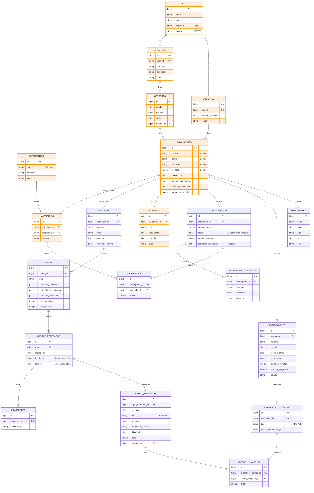

# Diagrama Entidad-Relación (ERD) - SISA 2.0 (Completo)

**Simbología:**
*   Las tablas en **NARANJA** (`:::university`) representan datos que provienen o se sincronizan desde el **Sistema Universitario**.
*   Las tablas en **AZUL** son propias de **SISA** (Datos locales enriquecidos).

